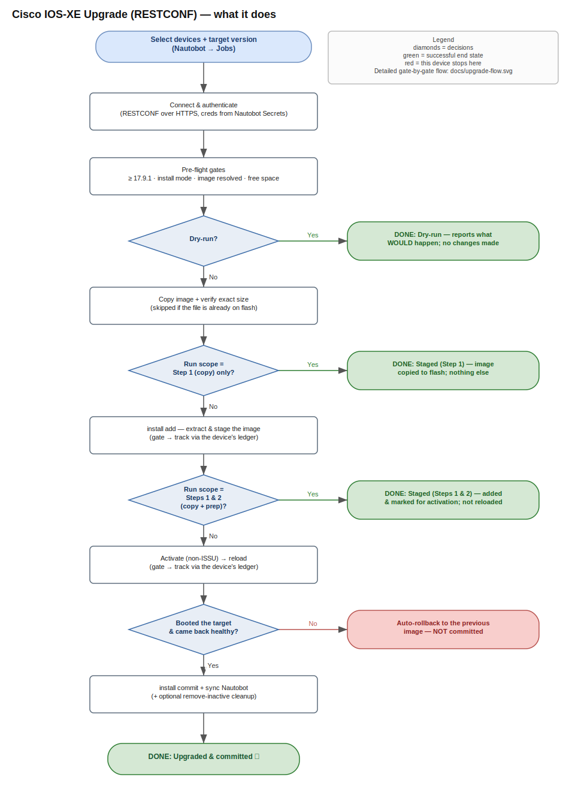

# nautobot-upgrades

A native **Nautobot Job** that reliably and cautiously upgrades **Cisco IOS-XE**
devices — **Catalyst 9300** primarily — driven entirely over **RESTCONF**.

## Current status: lab-proven

**Thoroughly exercised on real Catalyst 9300 hardware, entirely over RESTCONF —
but not yet production-vetted.** It is a working prototype under active
development: expect change between releases, read the Job Result logs, and
**always run Dry-run first**.

**Validated on real hardware** (Catalyst 9300 + a running Catalyst 8000V, from Nautobot 3.1):

- **Full upgrade _and_ downgrade** on **single switches**, repeatedly, across
  **17.12 → 17.15 ↔ 17.18 ↔ 26.1**.
- **Lettered rebuilds** as distinct versions (17.15.4 ↔ 17.15.4d), up and down.
- **Serial batches**, including a batch downgrade and correct already-on-target
  short-circuits.
- **Parallel batches at Parallelism 2** — run repeatedly (10+ times across
  various versions); the per-device isolation (own RESTCONF sessions, own
  ledger uuids) holds up in practice.
- **2-member stack**, up and down across **all tested trains** (17.12 ↔ 17.15 ↔
  17.18 ↔ 26.1): per-member free-space gating, package distribution, and the
  all-members-rejoined gate.
- **Ledger-tracked** add/activate/commit, engine-idle gating, byte-exact copy
  verification, auto-rollback-timer arming, remove-inactive, and interrupted-run
  (commit-to-be-safe) recovery.
- **Catalyst 8000V** (virtual router): full upgrade **17.12 → 17.15.5**
  end-to-end — `bootflash:` discovery, copy/add/activate/reload/commit all
  live on a running Cat8kv.
- Installs and runs as a Git Repository job on **Nautobot 2.4 and 3.1**; a full
  26.1.1 → 17.18.3 device install ran from a stock 2.4.36.

**Not yet proven — treat as experimental:**

- **Parallelism above 2** — validated at 2 concurrent; larger fan-out (up to
  16) and firmware-server contention at scale are not yet stress-tested.
- **The timed pre-staging cycle** — staging itself runs on hardware, but the
  full stage-ahead → window-run timing has not been measured.
- **Stacks larger than 2 members** — the 2-member stack is validated across all
  tested trains; larger stacks are not yet tested.
- **9300L/LM/X** and **9200 / 9400–9600** — identical image, flow, and models
  on paper, hardware runs pending; **17.9–17.11**. (C8000V batches/HA remain
  untested — the validation run was a single router.)
- **Failure paths on hardware**: auto-rollback expiry, a genuinely corrupt image,
  a member failing to rejoin.

Per-train and per-platform detail is in [Versions & support](#versions--support).

---

## Background & intended use

This project was built for a specific, common situation — and it is still a
**prototype**:

- **The fleet is uniform Cisco Catalyst 9300s.** A switching estate
  standardized on one platform and one image family, where an upgrade playbook
  that handles the 9300 well handles most of the network.
- **The inventory already lives in Nautobot.** Devices, platforms, primary
  IPs, and credentials (**Secrets**) are populated and maintained in a working
  Nautobot — so the source of truth for *what to upgrade* and *how to reach it*
  is already there, and this Job simply reads from it.
- **The team values REST.** Operators comfortable with REST and what it buys —
  structured request/response, idempotency, and true device state instead of
  screen-scraping CLI — rather than a traditional SSH/TFTP-driven upgrade.

It began as a **research question**: how much of an IOS-XE install-mode upgrade
could be driven *purely* over RESTCONF, with no CLI and no SNMP? On the code
trains this fleet runs, the answer turned out to be **essentially all of it** —
image copy, `install add`/`activate`/`commit`, reload, rollback, and the state
reads that gate each step. That result was strong enough to justify building
this prototype rather than stopping at a feasibility note.

**Where it stands:** the flow is working well and is thoroughly exercised in a
**lab** on real Catalyst 9300 hardware (see [Current status](#current-status-lab-proven)).
The intended next step is deliberate **production vetting** — the design is
conservative and its stability so far is encouraging, but "works in the lab" is
not "proven in production," so every run should still start with **Dry-run**.

**Key design choices** (from an up-front analysis, to avoid reinvention):

- **RESTCONF drives the entire upgrade** on modern IOS-XE — the
  `Cisco-IOS-XE-install-rpc` model (`install`/`activate`/`commit`/`remove`) plus
  the classic `Cisco-IOS-XE-rpc:copy`. The floor is **17.9.1**, the lowest
  model-complete release; older is refused. (The async `xcopy` was tried and
  abandoned — a real 17.15.05 silently broke it.)
- **Integrity without the on-device `verify` RPC**: optional server-side
  **hash-verify** at registration, a **byte-exact size match** after every copy,
  and `install add`'s **mandatory signature validation** before activation —
  stronger than an MD5 self-check because it catches tampering too. (The native
  `verify` RPC exists but returns only async event notifications with no pollable
  result, so it isn't used; it becomes a clean addition if Cisco ever makes the
  result pollable.)
- **Reuses Nautobot core, adds no data models of its own**: `dcim.SoftwareVersion`
  and `dcim.SoftwareImageFile` (core since Nautobot 2.2) already hold the image
  name, checksum, size, download URL, and device-type map.
- **Shipped as a Git Repository, not a packaged app** — the idiomatic way to
  deliver jobs from public GitHub. Its one constraint (git-delivered jobs can't
  install their own pip dependencies) is a non-issue here: the only dependency is
  **`requests`**, always present with Nautobot core.

## What it does

From the Nautobot **Jobs** page you scope target devices — filtering by
**location, role, status, platform, device type, current version, and tags** —
pick a target version, and the job runs an **install-mode** upgrade as a series
of PASS/FAIL gates, stopping at the first failure for a device. In one picture:

[](docs/overview-flow.md)

The seven core phases, plus the opt-in health-check bracket (the numbered keys
on the diagram above map to this list):

1. **Connect** — resolve the primary IP + credentials (from core Secrets),
   confirm RESTCONF is reachable.
2. **Pre-flight gates** — running version and already-on-target short-circuit;
   **≥ 17.9.1**; **install mode**; image resolved from Nautobot with device-type
   compatibility; **enough free space**.
3. **Copy + verify** — the device pulls the image (classic `copy` RPC, watched
   for live progress), gated on a **byte-exact size match**. Skipped if the file
   is already on flash.
4. **`install add`** — extract and stage the image to **every member**, with
   Cisco's **mandatory image signature validation** (a corrupt or untrusted
   image is rejected here). Like every engine write, it is **gated on
   engine-idle and tracked to true completion in the device's operation
   ledger** — never trusting the RPC's 2xx.
5. **Activate + reload** — **activate** (explicitly non-ISSU, by the device's
   full internal version; a silently-dropped activate is detected via the ledger
   and re-sent) → **reload**. A ledger-recorded failure aborts quoting the
   engine's own failing phase. (Where a release doesn't populate these signals,
   the job degrades to version-state inference and a settle timer, labeled as
   fallbacks in the logs.)
6. **Verify, then commit** — reconnect, confirm the target actually booted, and
   **only then** `install commit`. If it didn't come back or booted wrong, the
   job does **not** commit and the device auto-rolls-back.
7. **Sync + optional cleanup** — update `Device.software_version` in Nautobot;
   optionally `install remove inactive` to reclaim space (off by default).
8. **Health checks (opt-in)** — two opt-in steps bracketing the disruptive
   part: a **pre-test** baseline (**8a**) captured just before activation, and
   a **post-test** comparison (**8b**) after the sync — ports, CDP/LLDP
   neighbors, environment sensors, and the device's own reload-reason verdict.
   Report-only, with a ~10-minute convergence window. The full pre/post test
   lists are in [Pre/post health checks](#prepost-health-checks-report-only).

Every gate logs to the Job Result with the device attached (a **Debug** toggle
logs every RESTCONF call). Batches run **in parallel**
([details](#parallel-batches)); a per-device failure doesn't stop the batch, but
**any failure marks the whole Job Result FAILED**. Per-device durations and the
reload outage window are logged for change-window planning.

See the **[full gate-by-gate decision logic](docs/upgrade-flow.md)** for every
gate and abort.

## Versions & support

| Component | Supported | Notes |
| --- | --- | --- |
| **Nautobot** | **2.4 LTM** and **3.1+** | Job execution verified on **3.1 and multiple independent 2.4 environments** (most volume on 3.1). **3.0 is untested by choice** — unmaintained since 3.1 shipped. Earlier 2.x (≥ 2.2) *may* work but is untested. |
| **Device OS** | Cisco IOS-XE **≥ 17.9.1** (incl. 26.x) | Hardware-validated across **17.12–26.1**; every YANG model the job touches verified against Cisco's published models 17.9.1–26.1.1. Model presence ≠ runtime behavior — do one supervised run per new train. Rebuild letters (17.15.4**d**) are **distinct versions**. |
| **Platform** | Catalyst **9300 family** + **C8000V** | 9300 hardware-tested; **9300L/LM/X** run the identical cat9k image and flow (run pending). **C8000V** (autonomous): **validated live** — a full 17.12 → 17.15.5 upgrade on a running Cat8kv, with `bootflash:` discovered from the device. **9200** and **9400/9500/9600**: model sets identical (runs pending). **9800 WLC**: mechanically compatible but **operationally out of scope** — controller only, no AP predownload; a full-scope run is warned in-job. Nexus/NX-OS is a different API — not supported. **3650/3850 cannot be supported** (their terminal 16.12 train lacks the install API; Cisco's replacement, the 9300L, is supported). |

**By IOS-XE train:**

| Train | Status | Basis |
| --- | --- | --- |
| **17.12 / 17.15 / 17.18 / 26.1** | ✅ **Tested on real equipment** | Repeated upgrades **and** downgrades on 9300s — single switches **and** a 2-member stack across all four trains; lettered rebuilds; cross-era moves in both directions; serial and Parallelism-2 batches. Ledger tracking, engine-idle gating, byte-exact verify, the all-members-rejoined gate, remove-inactive, and interrupted-run recovery all exercised live. |
| **17.9 / 17.10 / 17.11** | ⚠️ **Not tested — might work** | Model-complete on paper (17.9 is the floor). Best used as an *escape source* (upgrade FROM it) — 17.9 left Cisco maintenance Aug 2025. Run one supervised upgrade first. |
| **< 17.9** | 🚫 **Not supported** | Refused: key API components are missing below the floor (the RESTCONF install models and reliable file-size reporting the job relies on). |

The job imports only **`requests`** plus Nautobot core, so there is no separate
Python dependency matrix — whatever ships with a supported Nautobot suffices.

## Authentication

Every device is contacted with credentials — nothing is attempted anonymously.
Credentials are resolved **at run time from Nautobot's Secrets manager**, never
typed into the job and never stored in job-run records (`has_sensitive_variables`
stays effective because no secret is a job input).

How it resolves, per device:

1. The job uses the device's assigned **Secrets Group** (`Device.secrets_group`),
   or the optional **Secrets group** job-input override.
2. It reads the **username** and **password** secrets, trying access types in
   order **RESTCONF → HTTP(S) → REST → Generic** (store them under **RESTCONF**).
3. They are sent as **HTTP Basic auth over HTTPS** — the mechanism IOS-XE
   RESTCONF uses (backed by the device's AAA: local / TACACS+ / RADIUS).

Because Nautobot Secrets are **provider-agnostic**, the secret values themselves
can live in environment variables, files, or an external manager (HashiCorp
Vault, AWS Secrets Manager, Azure Key Vault, Delinea, …) via the corresponding
Nautobot secrets-provider app — the job calls `get_secret_value()` and is
indifferent to the backend.

**Setup:** create a Secret for the username and one for the password → add both
to a **Secrets Group** under access type **RESTCONF** (secret types *username*
and *password*) → assign the group to each device (or pass it as the override).
The account must be **privilege 15** / authorized for `install` and `copy`.

The pre-flight check distinguishes the failure modes so the Job Result is
actionable: **HTTP 401** → bad/missing credentials; **HTTP 403** → authenticated
but under-privileged (needs privilege 15); **HTTP 502/503** → the RESTCONF
backend is still starting (typical for 1–3 minutes after enabling `restconf`
or right after a reload — wait and re-run); otherwise → connectivity /
RESTCONF not enabled.

## Image storage

The `.bin` images are **not** stored in Nautobot — Nautobot holds only the
metadata (`SoftwareImageFile`: name, checksum, size, `download_url`, device-type
map). **You serve the binaries from any web server the devices can reach.** The
transfer is a device-initiated `copy` RPC that just needs a URL it can `GET`, so
**any plain HTTP file server works** — there is no dependency on a particular
stack.

**HTTP is the validated path.** All testing to date uses **plain HTTP** (a
simple static file server handing out the `.bin`). **HTTPS should also work** if
the firmware server presents a certificate the devices trust — IOS-XE's TLS
client rejects self-signed certs — but it is **not yet tested or validated**, so
treat the **Use HTTPS URL** option as experimental. Encryption is also of
questionable value for this traffic: the images are public, Cisco-signed
binaries whose integrity is already checked independently (byte-exact size +
`install add` signature validation), so confidentiality buys little and
tampering is caught regardless. On a locked-down management segment, HTTPS here
may simply not be necessary.

**A convenient reference host: [nautobot-composer](https://github.com/bforejt/nautobot-composer).**
Its opt-in `firmware` profile is where all the testing ran, and it worked out
nicely: a **Filebrowser** UI (`:8088`, authenticated) for engineers to upload,
plus a read-only **nginx** service (`:9080` HTTP / `:9443` HTTPS,
network/ACL-restricted) that devices pull from. The Filebrowser-for-upload +
static-server-for-download split is a good pattern — but it is only one option;
any equivalent web server will do.

The **Register IOS-XE Image** job builds the device `download_url` from a
configurable base + the uploaded filename, validates the image is reachable
(preferring the worker's internal route, falling back to the device URL),
optionally downloads + hash-verifies it, and records the `SoftwareImageFile`
mapped to the compatible device types — creating the `SoftwareVersion` too if
you don't pick an existing one. It does **not** upload files — publish them to
your web server first.

Configure on the Nautobot worker: `FIRMWARE_BASE_URL` (device-facing base,
plain HTTP — e.g. `http://<host>/images/`), `FIRMWARE_BASE_URL_HTTPS` (the HTTPS
variant, stored instead when the **Use HTTPS URL** option is ticked — untested,
see above), and `FIRMWARE_INTERNAL_URL` (the worker's own validation route,
e.g. `http://firmware-download/images/`). The base is overridable per run.

See **[docs/image-storage.md](docs/image-storage.md)** for the reference
nautobot-composer design in detail: URL formats, the acquire → upload → register
workflow, TLS notes, and retention.

## Installing into Nautobot (getting started)

This project is consumed the standard Nautobot way — as a **Git Repository that
provides Jobs**. Nautobot clones the repo, discovers the Jobs in
[`jobs/`](jobs/), and runs them on its own Celery worker; there is nothing to
`pip install`. The mechanics of Git data sources and Jobs are core Nautobot
features maintained by Network to Code — this section covers the
project-specific basics as bullets and links out to NTC's documentation for the
detailed steps.

**Prerequisites**

- A working **Nautobot 2.4 or 3.1+** (see [Versions & support](#versions--support)).
  Don't have one? The same author's
  [nautobot-composer](https://github.com/bforejt/nautobot-composer) is a
  Docker-Compose stack that ships a matching Nautobot **and** the firmware
  server this job pulls images from.
- **Inventory in Nautobot**: each target device needs a **primary IPv4**
  reachable from the worker, a **device type** mapped to the target version's
  **Software Image File** (or a default image on the version), and an assigned
  **Secrets Group** exposing a username + password under the **RESTCONF** access
  type (see [Authentication](#authentication)).
- A **Software Version** record for the target with a **Software Image File**
  carrying at least a **download URL** and **image file name** (add the **file
  size** to enable the post-copy size gate). The device must be able to reach
  that URL over a transport it supports (https/http/scp/ftp/tftp); embed
  credentials in the URL if the host requires them. Binaries live on the
  firmware server, not in Nautobot — see [Image storage](#image-storage).
- **Devices**: Cisco IOS-XE **≥ 17.9.1**, booted in **install mode**
  (`flash:packages.conf`), with **RESTCONF enabled** (`restconf` +
  `ip http secure-server`) and a **privilege-15** account (or exec-authorized
  for `install`/`copy`). Enabling RESTCONF where it is absent is out of scope.
- No extra Python packages: the Job's only runtime dependency is `requests`,
  already present with Nautobot core.

**Steps** (the basics — follow the linked NTC docs for the full how-to)

- **Add the repository.** In Nautobot, go to **Extensibility → Git Repositories
  → Add**, set the remote URL to this public repo, pick a branch, tick
  **Provides: Jobs**, and **Sync**. Getting the URL into the right place and the
  sync options are walked through in NTC's
  [Git as a Data Source](https://docs.nautobot.com/projects/core/en/stable/user-guide/feature-guides/git-data-source/)
  guide (and the
  [Git Repositories](https://docs.nautobot.com/projects/core/en/stable/user-guide/platform-functionality/gitrepository/)
  reference).
- **Enable the Jobs.** Newly synced Jobs are **disabled** by default. Under
  **Jobs → Jobs**, in the **IOS-XE Upgrades** group, edit and **Enable** each of
  *Cisco IOS-XE Upgrade (RESTCONF)*, *Register IOS-XE Image*, and *Cancel IOS-XE
  Upgrade Run*. How enabling works is documented in NTC's
  [Managing Jobs](https://docs.nautobot.com/projects/core/en/stable/user-guide/platform-functionality/jobs/managing-jobs/).
- **Know how Jobs run.** Jobs execute on Nautobot's Celery worker and log to a
  **Job Result**; permissions, scheduling, and the run model are core Nautobot
  behavior, covered in NTC's
  [Jobs](https://docs.nautobot.com/projects/core/en/stable/user-guide/platform-functionality/jobs/)
  guide.
- **After changing Job code**, re-sync the repository; on non-container installs,
  restart the Celery worker so the new code is loaded.

Then head to [Running it](#running-it) for the first (Dry-run) execution.

## Running it

1. Populate the target **Software Version** + **Software Image File** in Nautobot
   (download URL, image file name, and ideally checksum + size), and map the
   image to the relevant **device type(s)**.
2. Open the job, optionally narrow the list with the **location / role / status /
   platform / device type / current version / tags** filters, select **devices**
   and the **target version**, leave **Dry-run** checked (the default), and run
   it. Dry-run executes every read-only gate and reports exactly what *would*
   happen.
3. When the dry-run is clean, run it again with Dry-run unchecked.

**Expected device log noise during an upgrade** (benign — do not stop on these):
`%ISSU-3-ISSU_COMP_CHECK_FAILED` appears on every `install add` (the engine
auto-probes for a hitless ISSU path that Catalyst 9300s in normal deployments
don't have; our upgrade is reload-based by design), and affected releases emit
SELinux `%SELINUX-1-VIOLATION` AVC-denial bursts whenever ANY process asks `smand`
for a filesystem listing — including this job's own file reads (copy
pre-check, progress polls, transfer verify — see
[SELinux AVC log events](#selinux-avc-log-events-cause-and-workaround)
for the cause and the workaround). The repeated `%DMI-5-AUTH_PASSED`
entries are this job's own RESTCONF polling.

### Parallel batches

Batch runs upgrade up to **Parallelism** devices concurrently (default **4**,
range 1–16; `1` = strictly one at a time). An upgrade is ~90 % waiting — copy,
install, reload — so parallelism collapses batch wall-clock dramatically: a
12-device batch at parallelism 4 is ~3 waves ≈ 90 minutes instead of ~6 hours
serial. Each device's result line carries its own `[total: …]` for the
change-window arithmetic.

**Validation to date is at Parallelism 2** (run 10+ times across versions in
the lab). The per-device independence below is by construction, so higher
fan-out is expected to behave — but treat anything above 2 as unproven: raise
it deliberately and watch the first runs (see
[Current status](#current-status-lab-proven)).

**Why it's safe**: every device is fully independent by construction — its own
RESTCONF sessions, its own per-operation correlation uuids in the device's
install ledger, its own gates and timers. Nothing is shared between device
threads except the read-only job inputs.

**Sizing Parallelism**: the practical limit is the firmware server's capacity
for simultaneous image pulls (each device downloads the full image during its
copy phase) and log readability. 4 is a comfortable default for the bundled
nginx firmware server; raise it after watching a batch's copy-progress lines
for signs of contention (all devices' transfer rates dropping together).

**Reading the logs**: per-device entries interleave in **time order**, each
still attributed to its device — use the Job Result's per-object filtering to
read one device's story in isolation. The final per-device results table and
the success/failure verdict are unchanged: **green still means every device
succeeded**, and any failure marks the whole Job Result FAILED with winners
and losers named.

**If the job's time budget expires mid-batch** (soft time limit, default
2 hours): in-flight devices are **stopped at safe step boundaries** — between
steps, never mid-decision — within about one poll interval; queued devices are
cancelled; and the post-mortem names three lists: completed, stopped/failed
(each entry carries its reason), and never started. Everything is safe to
re-run — the idempotent gates (copy/add skip-if-done, commit-to-be-safe) pick
each device up where it stopped.

### Cancelling a run

Native job cancellation is coming to **Nautobot core in 3.2** (a "Stop Job
execution" control —
[nautobot#2088](https://github.com/nautobot/nautobot/issues/2088), closed for
the v3.2 milestone). Until every supported train has it — the **2.4 LTM** line
and **3.1** predate 3.2 — this repo ships cancellation as a job: **Cancel IOS-XE
Upgrade Run**. It will remain here until all supported Nautobot trains can
cancel jobs natively — and even then only once we've confirmed the native
control gives the **same graceful result**. This cooperative stop is tuned to
the upgrade job (safe step boundaries, a drained post-mortem) and is likely
gentler than a hard, immediate kill; we're monitoring the 3.2 control and will
retire this job once it demonstrably matches. Pick the running Job
Result and run it — the upgrade run receives the same signal as the soft time
limit, which it handles **gracefully by design**: every in-flight device stops
at its next safe step boundary (never mid-decision, within ~one poll
interval), queued devices never start, and the cancelled run logs the full
**completed / stopped / never-started** post-mortem. Stopped devices are left
at safe boundaries — re-running the upgrade job later picks each one up
(idempotent gates + commit-to-be-safe). Cancelling a *queued* run simply
prevents it from starting.

### Pre-staging (stage now, activate in the window)

An install-mode upgrade splits into a **harmless half** (copy the image;
`install add` extracts, distributes to every stack member, and marks the
version for activation — no reload, no boot change, nothing armed, a
Cisco-supported resting state that survives power cycles) and the
**disruptive half** (activate → reload → commit). The **Run scope** input
lets you do the harmless half ahead of time:

- **`stage-add`** (recommended): every pre-flight gate + copy + a
  ledger-confirmed `install add`, then stop. The maintenance-window run
  (scope `full`) skips the finished work automatically — the idempotent
  gates recognize it — and needs only **activate → reload → commit**,
  collapsing per-device window time to roughly the reload (~10–15 min).
- **`stage-copy`**: stop after the size-verified copy — for fleets tight on
  flash (staged packages roughly double the image's footprint until the
  window).

Staging causes **no outage** (it structurally can't reach `activate`), so it is
the safe scope to run during business hours and to push **Parallelism** higher —
with the same "validated at 2, raise deliberately" caveat as any batch (see
[Parallel batches](#parallel-batches)) — and it pairs naturally with Nautobot's
native job scheduling ("stage the fleet overnight"). Structural guarantee: stage scopes return
before any code path that can reach `activate` — the only disruptive verb.
If plans change, a staged image is inert; `install remove inactive` (or the
Remove-inactive option on a later run) reclaims the space.

**Clean-then-stage** for tight-flash devices (4 GB 9200s, 8 GB C8000V
profiles): tick *Clean device first* together with a stage scope — the device
is groomed by the install engine, the free-space gate evaluates the cleaned
flash, and the staged image lands with maximum headroom.

**The safe step is the default**: Run scope defaults to *Step 1 - Copy
image*, so an actual upgrade requires **two deliberate acts** — unchecking
Dry-run *and* selecting *Full* — and a forgotten dropdown can never reload a
device (the run just stages and says so). Anyone automating runs via the API
should pass `run_scope` explicitly.

### Cleaning a device first

The **Clean device first** checkbox tells the job to groom the device
*before* upgrading: it runs the install engine's own `install remove
inactive`, which deletes every piece of software the device is not
currently running — inactive packages, leftover image files, **and any
version another engineer may have staged**.

⚠️ **What you are accepting when you tick it:**

- **Anything in-flight is deleted.** A staged version usually means someone
  else's change is already underway. Normally the job STOPS when it finds a
  conflicting staged version (the staged-conflict safety stop); this
  checkbox is the deliberate override. Tick it only when you know the state
  of the network and nothing else is planned for this device.
- **It does NOT remove the rollback image for THIS upgrade.** The currently
  running version is active software, which `install remove inactive`
  cannot touch — and that is exactly what becomes the rollback image once
  the new version activates. What the clean deletes is one generation
  older: the version kept on flash from a *previous* upgrade. If that
  earlier upgrade is still in its soak window, cleaning removes its
  rollback option (going back that far would mean re-running this job
  targeting that version — a full re-copy).

The setting that DOES remove this upgrade's rollback image is **Remove
inactive (after commit)**: once the new version is committed and running,
the replaced version becomes inactive, and that option reclaims its space
right away instead of keeping it for a soak period (default off).

Mechanics: the clean runs before the free-space gate, so the gate evaluates
the CLEANED flash (this is the **clean-then-stage** pattern for tight-flash
devices described above). Clean failures abort the device's run; a dry-run
only reports what would be removed.

### Saving running-config before the reload (Full runs)

The CLI `reload` asks *"System configuration has been modified. Save?"* —
**RPC-triggered reloads never do.** The reload our activation triggers simply
discards unsaved running-config changes (Cisco's own model says as much: the
reload RPC's `force` leaf is described as *"Force a restart even if there is
unsaved config"*).

The job **cannot detect** whether a save is needed: the only
programmatically-readable source for the saved/unsaved determination is the
config-management timestamps served through the device's **SNMP bridge**
(`CISCO-CONFIG-MAN-MIB`), which requires an `snmp-server` configuration and
simply hangs without one — a dependency this project deliberately does not
take (verified on real hardware; no native YANG replacement exists even on
26.1). Detection was therefore removed.

What the job does instead:

- Tick **Save running-config before reload** and the job performs the save
  itself (`cisco-ia:save-config`, the programmatic `write memory` — a native
  DMI RPC with no SNMP dependency) right before activation. A refused or
  failed save **aborts before the reload**; success is confirmed by the
  device's own result string. Default **off**: saving is itself a write, and
  it would persist half-applied changes an engineer deliberately left
  unsaved.
- With the box unticked, Full runs log a one-line reminder of the platform
  fact before activating, so the silent-discard behavior is never a surprise.


### Saving running-config after the commit (opt-in, soak trade-off)

**Save running-config after commit** (default **off**) writes running-config to
startup-config *after* the upgrade is committed and Nautobot is synced — the
programmatic `write memory`, verified by the device's own RPC result exactly
like the pre-reload save.

**Why you might want it:** after booting the new version, running-config is the
new OS's *canonical rendering* of your configuration — translated syntax and
new defaults included. Saving normalizes startup to that rendering, which
captures the translation deliberately and eliminates the persistent
startup/running diff that compliance tooling (Golden Config included) would
otherwise flag until someone's unrelated `wr mem` months later.

**Why it's off by default:** during the **soak window**, a startup written by
the *new* OS may carry syntax the *old* image cannot cleanly parse — so leaving
startup in old-version form preserves the cleanest rollback/downgrade path.
This is why Cisco's own upgrade guides save *before* the reload, not after. The
conservative pattern is: upgrade → soak → then save (re-tick this on a later
run, or `write memory` by hand).

Notes: applies to the run that performs the activation (an already-on-target
re-run does not save). It does **not** interact with the *Quiet SELinux log
noise* filter — the activation reload erased that from running-config before
this save runs (only the *pre-reload* save persists it). A refused/failed
post-commit save FAILS the device with an explicit message — the upgrade
itself **stays committed**, and the message says to save manually.


### Golden Config backups (before & after)

**Golden Config backup (before & after)** (default **off**) wraps the run in
two configuration snapshots: the job enqueues the **Golden Config backup job**
for exactly the selected devices *before any upgrades start*, waits for it to
finish, and runs it again *after all devices finish* — so you have a
known-good config capture on both sides of the reload, and Golden Config's
own diff/compliance views show any drift the upgrade introduced.

Requirements and mechanics:

- Requires the **Golden Config app** with its backup job installed, enabled,
  and working for these platforms (the job is found by class `BackupJob` in
  `nautobot_golden_config*`, falling back to the name "Backup
  Configurations"). This stays inside the project's charter — it orchestrates
  another **Nautobot job**; Golden Config does its own transport under its
  own configuration, and this job still never touches SSH.
- **Fail-closed before, warn-only after:** if the *before* backup is
  unavailable, fails, or times out, the run **aborts before touching any
  device** — an explicitly requested safety net must not silently not exist.
  A failed *after* backup logs a warning and never un-succeeds completed
  upgrades. The *after* backup runs even when some devices failed (capturing
  state then is exactly the point) but is skipped on the cooperative-stop
  path.
- Each backup waits up to **15 minutes** (`GC_BACKUP_TIMEOUT`), polling the
  enqueued Job Result; both Job Result ids are logged for the audit trail.
  Budget the two waits against the job's soft time limit on big batches.
- **A free worker slot is required**: the backup runs as a separately queued
  job while this job occupies its own slot — a **concurrency-1 Celery worker
  will always time out here** (the timeout message says so). If the run aborts
  or is cancelled mid-wait, the already-enqueued backup keeps running
  harmlessly under its own Job Result.
- **Coverage is verified, not assumed**: Golden Config silently intersects the
  device filter with its own settings scopes, so a SUCCESS can cover fewer
  devices than selected. After each backup the job checks GC's own per-device
  bookkeeping — a coverage gap **aborts** the *before* run (and warns after),
  naming the uncovered devices.
- **Runs on every Run scope**, staging included — cheap insurance around any
  change. For business-hours staging runs where the ~15-minute waits aren't
  worth it, leave it unticked and rely on the Full run's backups.
- **Dry-run stays read-only** — it logs what would be backed up and skips
  both snapshots.


### Pre/post health checks (report-only)

**Pre/post health checks** (default **off**) snapshot the device's network
health immediately **before activation** and compare it **after the commit** —
looking for the things an upgrade quietly breaks: ports that never came back,
downstream switches or APs no longer seen, a power supply that didn't survive
the reload, or a boot the device itself classifies as a crash. On the
[overview diagram](docs/overview-flow.md) these are the **8a** (pre-test) and
**8b** (post-test) decision branches.

**Pre-test (8a)** — the baseline, captured immediately before activation
(fail-closed: if this snapshot can't be read, the device aborts *before*
anything reloads):

- Every port's admin/oper state, plus which ports count as
  **trunk/infrastructure** (configured `switchport mode trunk` ∪ ports with a
  CDP **Switch**-capability peer)
- The CDP neighbor table — which neighbor, on which local port
- The LLDP neighbor table — same shape, independent second feed
- Environment sensors (power supplies, fans, temperature) and their states
- Attached as the `health-pre_<device>.json` artifact

**Post-test (8b)** — after the commit and Nautobot sync, re-polled for up to
~10 minutes so slow converging things (STP, PoE-powered APs, CDP holdtimes)
get a fair chance to return:

- Every port that was admin-up **and** oper-up before is up again — **error**
  on trunk/infrastructure ports, warning on access ports
- Every CDP and LLDP neighbor is back **on the same port**, distinguishing
  *gone* from *moved* (a lost redundant uplink to the same upstream counts as
  gone, not moved)
- No environment sensor that was healthy before is degraded now
- The device's **own reload-reason verdict** is not *abnormal* — i.e. the
  reboot was the upgrade, not a crash
- New ports, new neighbors, and pre-existing bad sensors are **noted, never
  flagged**
- Attached as the `health-post_<device>.json` and
  `health-report_<device>.json` artifacts

Severity reference:

| Check | Source (all pure oper reads — no config writes, no AVC noise) | Finding | Severity |
| --- | --- | --- | --- |
| Port states | `interfaces-oper` | admin-up port that was oper-up before, still down after convergence | **error** on trunk/infrastructure ports, warning on access |
| Trunk identification | interface **config** (`switchport mode trunk`) ∪ CDP Switch-capability peers | classifies severity above | — |
| CDP neighbors | `cdp-oper` | neighbor gone, or moved to a genuinely new port (a lost redundant uplink to the same upstream counts as *gone*, not moved) | warning; **error** when the affected port is a trunk |
| LLDP neighbors | `lldp-oper` | same comparator, second feed | same |
| Environment | `environment-oper` | sensor healthy before, degraded after (pre-existing bad sensors are noted, never flagged) | **error** |
| Reload reason | `device-hardware-oper` (`last-reboot-reason` + `reason-severity`) | the device's OWN verdict that the reboot was **abnormal** — a typed enum, not string-matching | **error** |

Semantics, all deliberate:

- **Report-only**: findings are logged at error/warning level and attached as
  Job Result artifacts — they never un-succeed a committed upgrade. (Gating
  the commit on health is a possible future opt-in with real
  rollback-loop risks; not built.)
- **Convergence-aware, not snapshot-at-an-instant**: everything up-before
  must return within ~10 minutes (`HEALTH_CONVERGENCE_TIMEOUT`) — ports
  renegotiate, STP reconverges, PoE-powered APs take minutes to boot, CDP
  ages in at 180-second holdtimes. The post-check re-polls until clean or
  deadline (the budget is approximate: the final in-flight capture may run
  a couple of minutes past it).
- **Fail-closed baseline**: if the pre-snapshot cannot be captured, the
  device aborts *before activation* (nothing has reloaded yet, so the abort
  is free). A requested baseline must exist.
- **Empty classes auto-skip, loudly**: a device with no CDP neighbors before
  the upgrade logs "class skipped" — never silence, never a failure. The
  baseline scope is always declared ("22 ports up (4 trunks), 9 CDP, …").
- **Comparison in memory, artifacts for audit**: the diff only ever compares
  two observations made by the same run; `health-pre/post/report_<device>.json`
  are attached to the Job Result (retention rides Nautobot's JobResult
  cleanup) and are never read back for decisions.
- **New things are never findings**: new ports up, new neighbors — noted,
  not flagged.
- Full runs only (stage scopes never reload, so there is nothing to compare).

**Deliberately excluded** (false-positive machines in a post-boot window):
CPU/memory (legitimately high right after boot), full routing-table diffs,
full STP state. **v2 queue**: OSPF/BGP/EIGRP/HSRP adjacencies (same
comparator pattern), PoE per-port power, MAC/ARP count sanity,
syslog-traceback scan, per-stack-member reboot reasons.

### ISSU-capable platforms (9400/9500/9600): install mode only

**This job upgrades in _install mode_ only — including on ISSU-capable
platforms.** Install mode (`install add`/`activate`/`commit`) is the standard
IOS-XE upgrade method on every Catalyst platform this job supports; **ISSU is an
optional overlay on that same workflow** (`install activate issu`), not a
separate system. This job's activate is **explicitly non-ISSU**, so on a
StackWise Virtual pair or a dual-supervisor chassis it performs the ordinary
reload-based activation: the device reloads **as a whole** and comes back on the
target version — a correct, complete upgrade, but with a **full reboot outage**,
exactly like a 9300.

**Why we are confident this works on those platforms** (validated by design; one
supervised run per new platform is still the recommended due diligence):

- The install-mode YANG models the job drives (`install-rpc`, `install-oper`,
  `q-filesystem`, `copy`, `device-hardware-oper`) are **verified identical
  across 9300 / 9400 / 9500 / 9600** — it is the same code path, not a
  platform-specific one.
- The confirmation choreography — activate → observe the device go **DOWN**
  (reload) → confirm it booted the target → commit — is exactly how a non-ISSU
  install-mode activate behaves on a redundant chassis (both supervisors / both
  SVL members reload together). **ISSU is the only variant that avoids the
  device-down signal**, and the job never requests it.
- Stack/SVL handling already gates on **all members** reporting install mode,
  having free space, and **rejoining after reload** — the 2-member stack is
  hardware-validated, and an **SVL pair (two chassis)** rides the same gates. (A
  single-chassis **dual-supervisor** system reports as one chassis, so the
  rejoin gate confirms the chassis rebooted but does not separately verify the
  standby supervisor rejoined.)
- The activate payload sets **`issu: false` explicitly** — an ambiguous
  (issu-unspecified) request fatally failed activation on a real 17.15.4 with an
  "ISSU compatibility check" — so it is unambiguously the standard reload path
  and cannot accidentally invoke ISSU. It also omits `auto-abort-timer-val`,
  leaving the platform's **default rollback timer** to apply (verified after
  reload).

The one honest gap is **hardware confirmation on 9400/9500/9600** (model sets
proven identical, a supervised run pending — see
[Versions & support](#versions--support)). The *behavior* is validated by the
above; the *platform run* is the same due-diligence step as any new platform.

**ISSU itself is out of scope — by charter.** This project is deliberately built
on exactly three primitives: **RESTCONF, install mode, and Nautobot jobs**. ISSU
is a fundamentally different behavior — hitless, rolling standby-first, no
device-down event — that would need its own confirmation model and would pull
the job past that single focus. Supporting ISSU here would violate the project's
charter, so **there is no current plan**. We may add a **sister job**, or add
ISSU support later **if it proves safe and easy**, but not as part of this one.

**If you must run a real ISSU**, the job can still assist the RESTCONF-able
parts: stage with Run scope *Steps 1 & 2* (verified copy + ledger-confirmed
`install add` on the pair, non-disruptive), perform `install activate issu` by
hand in the window, then re-run the job at scope *Full* — the already-on-target
path runs **commit-to-be-safe** and syncs Nautobot. This assist is a
convenience, **untested against a real SVL / dual-sup pair**, not a supported
mode.

### Job inputs

| Input | Required | Purpose |
| --- | --- | --- |
| Location / Role / Status / Platform / Device type / Current version / Tags | no | Optional filters that narrow the **Devices** picker for field operations. |
| Devices | yes | Target devices to upgrade (narrowed by the filters above). |
| Target version | yes | Core `SoftwareVersion` to upgrade to. |
| Clean device first | no | ⚠️ **Default off.** Before upgrading, remove ALL software the device is not running — including **any version another engineer staged** (overrides the staged-conflict stop). See [Cleaning a device first](#cleaning-a-device-first). |
| Run scope | no | Order of operations, safest first: **Step 1 - Copy image** (**default** — a forgotten dropdown can never reload a device), **Steps 1 & 2 - Copy image and prep** (`install add`, no reload), **Full - Copy, Activate, Reload** (the only choice that reloads; a real upgrade requires selecting it deliberately). See [Pre-staging](#pre-staging-stage-now-activate-in-the-window). |
| Save running-config before reload | no | **Default off.** RPC reloads never prompt to save, and the job cannot detect whether a save is needed (SNMP-only source — dependency declined). This box makes the job save (`cisco-ia:save-config`) before activating, aborting if the save is refused or fails. See [Saving running-config](#saving-running-config-before-the-reload-full-runs). |
| Save running-config after commit | no | **Default off.** After the commit and Nautobot sync, write running-config to startup. Normalizes startup to the new OS's rendering (ends the persistent startup/running diff) — **but** during the soak window an old-syntax startup is the safer rollback path. See [Saving running-config after the commit](#saving-running-config-after-the-commit-opt-in-soak-trade-off). |
| Golden Config backup (before & after) | no | **Default off.** Snapshot configs via the Golden Config backup job before any upgrades start (failure **aborts** the run) and after all devices finish (failure warns). Requires the Golden Config app. See [Golden Config backups](#golden-config-backups-before--after). |
| Pre/post health checks | no | **Default off.** Snapshot ports, CDP/LLDP neighbors, and environment before activation; compare after commit with a ~10-min convergence window. Report-only: trunk-port and environment findings log at error level, the device's own abnormal-reboot verdict is checked, artifacts attach to the Job Result. See [Pre/post health checks](#prepost-health-checks-report-only). |
| Quiet SELinux log noise on terminals | no | **Default off.** The SELinux AVC-denial messages come from how the job watches files during an upgrade (observed so far only on Catalyst 9300 switches; benign in our testing — not a Cisco-confirmed cosmetic defect; see below); enable this if you watch the **physical console or terminal-monitor (SSH)** and want them quieted there. `show logging` and syslog servers still record everything. Applied to the RUNNING config at the start of the run (every release); unsaved — erased by the reload — unless combined with *Save running-config before reload* on a **Full** run. See [SELinux AVC log events](#selinux-avc-log-events-cause-and-workaround). |
| Secrets group override | no | Force one Secrets Group for the whole run; by default each device uses its own assigned group. |
| Remove inactive | no | After commit, reclaim space (default **off** — keeps the rollback image for a soak period). |
| Parallelism | no | Devices upgraded concurrently (default **4**, max 16; 1 = serial). **Hardware-validated at 2 so far**; higher fan-out is unproven. Size to the firmware server's capacity for simultaneous image pulls. |
| Debug | no | Verbose RESTCONF request/response logging. |
| Dry-run | — | Read-only pre-flight only (default **on**). |

### RESTCONF operations used

| Step | RESTCONF call |
| --- | --- |
| Read version | `GET .../Cisco-IOS-XE-device-hardware-oper:device-hardware-data/device-hardware/device-system-data` |
| Stack member roster | `GET .../Cisco-IOS-XE-device-hardware-oper:device-hardware-data/device-hardware/device-inventory` |
| Install state / mode / ledger | `GET .../Cisco-IOS-XE-install-oper:install-oper-data` |
| Boot-config filesystem hint (zero-walk; corroborated against partitions) | `GET .../data/Cisco-IOS-XE-native:native/boot` |
| Partition stats (discovery corroboration + space gate — **one shared read**) | `GET .../q-filesystem?fields=fru;slot;bay;chassis;partitions(name;total-size;used-size)` |
| Full file listing (copy pre-check, first-sighting learn, transfer verify) | `GET .../Cisco-IOS-XE-platform-software-oper:cisco-platform-software/q-filesystem` |
| Per-poll copy progress after the learn (walk-free, no SELinux bursts) | `GET .../q-filesystem=<fru>,<slot>,<bay>,<chassis>/partitions=<name>/partition-content=<full-path>` (address exactly as a real listing published it) |
| Copy image | `POST .../operations/Cisco-IOS-XE-rpc:copy` (worker thread) |
| Add / activate / commit / remove | `POST .../operations/Cisco-IOS-XE-install-rpc:{install,activate,install-commit,remove}` |
| Health snapshots (opt-in; pre + convergence re-polls) | `GET .../Cisco-IOS-XE-interfaces-oper:interfaces/interface?fields=name;admin-status;oper-status`, `GET .../cdp-oper:cdp-neighbor-details`, `GET .../lldp-oper:lldp-entries`, `GET .../environment-oper:environment-sensors`, `GET .../device-hardware-oper:.../device-system-data` (reboot reason) |
| Trunk identification (opt-in, once at the pre-snapshot) | `GET .../Cisco-IOS-XE-native:native/interface` (config read) |
| Save running-config (opt-in) | `POST .../operations/cisco-ia:save-config` |
| AVC suppression filter (opt-in) | `GET`/`PATCH .../data/Cisco-IOS-XE-native:native/logging` (read-before-write; merge only) |

## Configuration

Release- and site-specific knobs live in [`jobs/constants.py`](jobs/constants.py):
the version floor, target filesystem (`flash:`) and its **partition-name match**
(`TARGET_FS_CANDIDATES`), timeouts, and space headroom (~2× the image size).
The target filesystem is resolved per device, **boot config proposes and
runtime state disposes**: a zero-walk read of the device's `boot system`
config names the filesystem it actually boots from ("flash:packages.conf" →
`flash:`), and the partition listing — the same single read the free-space
gate consumes — must corroborate it (an uncorroborated hint is discarded
with a warning; no usable hint falls back to partition-name discovery,
`flash:` on Catalyst switches, `bootflash:` on C8000V). If a platform names
its writable filesystem something else entirely, the discovery-failure abort
now reports what the boot config points at — add that name to
`TARGET_FS_CANDIDATES`.

## Reuse & licensing analysis

This project is **Apache-2.0** (see [`LICENSE`](LICENSE)). The up-front analysis
looked hard for something to reuse before writing code:

- **No permissive OSS library ships a turnkey "upgrade IOS-XE" function**, and
  **none of the Nautobot OSS apps** (Device Lifecycle Mgmt, Golden Config,
  device-onboarding, nornir-nautobot) ship a software-install/upgrade job. So the
  orchestration here is new — but it deliberately **reuses Nautobot core** for
  all data (software versions, images, hashes, credentials) and uses only
  **`requests`** for transport.
- **Cisco pyATS/Genie "Clean"** (Apache-2.0) is the best open reference for
  correct install-mode sequencing; it was used as a **design reference only**, not
  a runtime dependency (it's heavy and unnecessary for RESTCONF).
- ⚠️ **Avoided on licensing grounds:** the `cisco.ios` Ansible collection and
  community IOS-XE upgrade Ansible roles are **GPLv3** (copyleft) — their code is
  **not** copied here, only their behavior studied. Network to Code's commercial
  **"OS Upgrades"** Nautobot app is **closed-source** — reference only.

Everything actually depended on (`requests`, Nautobot core) is permissive
(Apache-2.0 / MIT) and compatible with this repo's license.

## Known limitations / not yet done

- **Hardware validation covers 17.12, 17.15, 17.18, and 26.1** on single
  switches and a 2-member stack, from Nautobot 3.1 and 2.4 — other platforms
  (9200, 9400–9600) are admitted on model evidence (see
  [Versions & support](#versions--support)); do one supervised run
  per newly-encountered train or platform. On releases whose devices don't populate
  the operation ledger or `sys-activity` at runtime, the job degrades to
  version-state inference and a settle timer — clearly labeled in the logs.
- **The activate sets `issu: false` explicitly and omits `auto-abort-timer-val`.**
  An ambiguous (issu-unspecified) request fatally failed activation on a real
  17.15.4 with an "ISSU compatibility check", so `issu: false` is sent
  explicitly; `auto-abort-timer-val` is left off so the platform's **default
  rollback timer** applies, confirmed after reload (observed arming at 7200 s on
  17.15.x).
- Free-space and file-size reads use **release-dependent** q-filesystem paths
  (exact/stack-suffix partition match) — tunable via `constants.py` if a
  platform names its flash differently.
- Stack/SVL handling checks that **all members** report install mode, have the
  free space, and rejoin after reload; per-member deep health checks are
  minimal.
- Some platforms/releases (observed so far: Catalyst 9300 switches; a C8000V
  run showed none) emit SELinux AVC bursts around filesystem
  listings — see [SELinux AVC log events](#selinux-avc-log-events-cause-and-workaround)
  for the cause, when the job triggers them, and the optional quieting.

## SELinux AVC log events (cause and workaround)

**What they are.** On affected platforms/releases — **observed so far only on
Catalyst 9300 switches** (at 17.15.x and 17.18.3); a full C8000V upgrade run
(17.12 → 17.15.5) showed **none** — the platform's SELinux policy
denies `smand` (the shell/storage manager) read access to a handful of on-flash
paths (`biosupgrade`, `yang-infra`, and similar) that it touches whenever it
builds a **filesystem listing**. Each listing sprays a burst of
`%SELINUX-1-VIOLATION` AVC-denial lines (~100 observed per listing on a real
9300 in our lab). Anything that walks the filesystem can trip it. In one
correlated capture (this job's log lined up against the device console), the
**overwhelming majority came from our own q-filesystem reads** — ~318 of 319
denials — while a single denial came from an `install remove` operation itself;
an operator's `dir`/`show` would trip it too. A later **complete** run
(copy → add → activate → commit) settled the rest: **1,618 denials, every one
during the job's own read phases — `install add`, `activate`, and `commit`
contributed zero** (correlation below).

**What Cisco documents — and what it does not.** `%SELINUX-1-VIOLATION` is a
documented IOS-XE SELinux message, not an error unique to this job. Cisco's
*Support for Security-Enhanced Linux* chapter (e.g. the
[Catalyst 9800 config guide, IOS-XE 17.15.x](https://www.cisco.com/c/en/us/td/docs/wireless/controller/9800/17-15/config-guide/b_wl_17_15_cg/m_support_for_security_enhanced_linux.html)
— SELinux is a common IOS-XE feature across switches and controllers) documents
the message, the Enforcing (default) / Permissive modes, and the
`show platform software selinux` and denial-count commands. Two facts from that
page are worth being honest about: Cisco lists `%SELINUX-1-VIOLATION` as an
**alert-level** event where, in Enforcing mode, **the access is denied and the
operation fails**, and its **recommended action is to contact Cisco TAC** — not
"ignore it." So Cisco does **not** document these as universally cosmetic, and
the Bug Search Tool bears that out: some `%SELINUX-1-VIOLATION` bursts are
genuinely harmful (process crashes, install failures — e.g. CSCwk19620,
CSCwt91818), while others were judged benign for a specific case — e.g.
[CSCwr09316](https://bst.cloudapps.cisco.com/bugsearch/bug/CSCwr09316) (a
config-group AVC burst on routers), whose Cisco workaround says *"these internal
messages can safely be ignored as they have no impact."*

**Is *our* burst a harmless Cisco bug? Honestly — we can't cite Cisco for
that.** A direct Bug Search Tool hunt (logged in) for our exact denial —
`smand`, `biosupgrade`, `yang-infra`, filesystem-listing on the 9300 — returned
**no matching Cisco defect**. What we can stand behind is our own field finding:
across every lab upgrade this burst appeared and **no operation failed** — the
listing returned and copy / `install add` / activate / commit all completed,
consistent with a read-only denial on paths the listing does not actually need.
So treat it as **benign in our testing, not a Cisco-confirmed cosmetic defect**.
If the burst ever coincides with a real failure on your gear, follow Cisco's own
guidance and open a TAC case rather than assuming it is noise.

**Why the job triggers them — and how it minimizes them (2026-07-12).**
Correlating a full run's job log against the device console showed the copy
watcher's per-poll full listings were ~91% of the noise (1,470 of 1,618
lines; the install engine's add/activate/commit emitted zero). So the copy
watcher now **learns, then goes quiet**: it full-reads only until it sights
the growing file, records that entry's own published address, and polls that
single keyed entry from then on — a walk-free read that is field-proven to
emit **no** AVC lines. The keyed address is pure observation (never a
guessed mount root — the guessing tiers were deleted 2026-07-10 for
reliability, and they stay deleted), and it is **progress-only**: a missing keyed
answer re-learns from the next full listing, and a rejected URL form or two
consecutive misses **latch a loud full-listing fallback** — the pre-change
behavior is the floor, never entered silently. The copy pre-check and the
byte-exact verify always use the authoritative full listing. Expected
bursts per fresh copy on an affected release: a **handful** — ONE shared
partition-stats read serving both discovery and the free-space gate
(`fields`-scoped for payload size, but the device still walks
server-side; the boot-config read that picks the filesystem is zero-walk),
the pre-check listing, the watcher's full read(s) until the first
sighting, and the final verify listing — instead
of **one every 30 seconds for the whole transfer** (~30 for a 15-minute
copy; the device's audit rate-limiter sometimes truncates the tail of
that storm, but a fresh run is loud). Every fallback still logs a
breadcrumb attributed to its device.

**Job-managed quieting (opt-in).** The messages did not affect any upgrade in our testing (above) — a result
of how the job (and any `show` command) watches files on the filesystem —
so most operators can simply ignore them. But if your upgrade process
involves watching the physical console or terminal-monitor over SSH, you
may want to enable the *Quiet SELinux log noise on terminals* checkbox to
quiet them. It makes the job apply the workaround itself, scoped to where
the noise actually bothers people: it inserts the `NBAVC` discriminator
into the **running config** as early in the run as possible (so even the
gates read is filtered) and attaches it to the **physical console and
terminal-monitor (SSH) sessions only**. The `show logging` buffer and
syslog hosts deliberately stay unfiltered — they are the record (genuine
SELinux events share this facility and remain fully visible there); the
terminals are the noise. The filter is applied on every release (the
messages are not tied to one train). The job never replaces an existing
operator discriminator, logging mode, or an operator-owned `NBAVC` entry
with different content; `no logging console/monitor` and filtered/XML
modes are skipped rather than flipped; and any refused write warns instead
of failing the run. The change is unsaved — the activation reload erases it
— unless combined with *Save running-config before reload* on a Full run,
which makes it persistent. Confirm with `show run | include NBAVC` —
three lines:

```
logging discriminator NBAVC facility drops SELINUX
logging console discriminator NBAVC
logging monitor discriminator NBAVC
```

**Manual workaround** (same effect, applied by hand — filters these SELinux
denials from the console/buffer without touching the underlying policy):

```
logging discriminator NOSEL msg-body drops SELINUX
logging console discriminator NOSEL
logging buffered discriminator NOSEL
```

Remove the discriminator after the upgrade window if you prefer to keep
SELinux visibility day-to-day.

## Deferred (by agreement — not built yet)

These were intentionally left out to keep the first cut small; revisit as
separate, agreed features:

- A companion job to **enable RESTCONF** on devices that lack it (needs a
  non-RESTCONF channel to bootstrap).
- **Native ISSU mode for 9400/9500/9600 HA pairs**: `issu: true` on the
  activate (the RPC leaf already exists) plus ISSU-aware confirmation —
  today's logic requires observing the device go DOWN, which an ISSU
  deliberately avoids. **Out of scope by charter** (RESTCONF + install mode +
  Nautobot jobs) with **no current plan** — see
  [ISSU-capable platforms](#issu-capable-platforms-940095009600-install-mode-only).
  A future sister job or in-job mode would need a lab SVL / dual-sup pair to
  define the ISSU confirmation choreography.
- **Catalyst 9800 wireless-aware mode**: AP image predownload between add and
  activate (`Cisco-IOS-XE-wireless-access-point-cmd-rpc:set-rad-predownload-all`
  is available at our floor), AP-fleet completion polling, and SSO awareness —
  until then the job warns and leaves 9800s to deliberate full-outage use.
- **Device Lifecycle Management** integration for **validated/approved-software
  gating** and CVE/EoL/contract context.
- User-based **authorization/gating** of who may run upgrades.
- Deeper stack/redundancy and post-upgrade interface/protocol health checks.

## License

Apache License 2.0 — see [`LICENSE`](LICENSE).

## Disclaimer

This software is provided **"AS IS"**, without warranties or conditions of any
kind, under the terms of the [Apache License 2.0](LICENSE) — including its
**Disclaimer of Warranty (§7)** and **Limitation of Liability (§8)**:

- **No warranty.** There is no warranty of any kind, express or implied —
  including, without limitation, any warranties of merchantability, fitness
  for a particular purpose, title, or non-infringement. You are solely
  responsible for determining the appropriateness of using this software and
  assume all risks of doing so.
- **No liability.** In no event shall the authors, contributors, or copyright
  holders be liable for any damages of any character arising from the use or
  inability to use this software — including, without limitation, network
  outages, device or hardware failure, data loss, loss of profits, or any
  other commercial damage — even if advised of the possibility of such
  damages.

Be aware of what this tool does: it **copies software to, and reloads, live
network equipment**. If you choose to run it in your own environment, you do so
entirely **at your own risk** — validate in a lab first (see
[Current status](#current-status-lab-proven)), keep Dry-run on until proven, and
maintain your own change-control and rollback procedures. Use of this software
constitutes acceptance of the license terms above.
