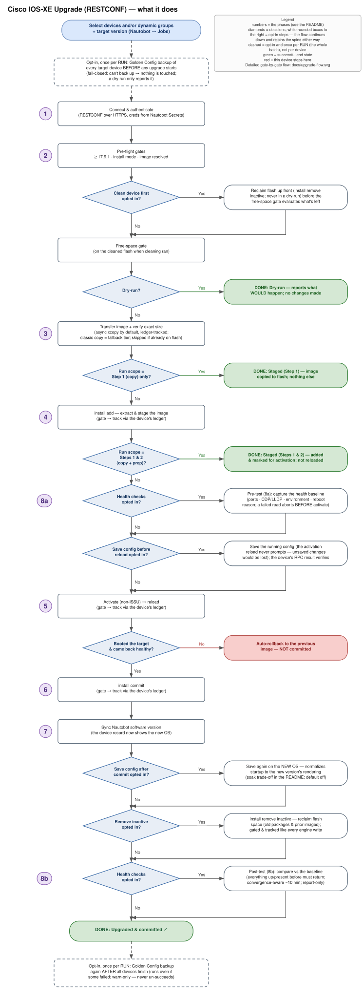

# nautobot-upgrades

Native **Nautobot Jobs** that upgrade **Cisco IOS-XE** devices — Catalyst
switches and, via a sibling job, Catalyst 9800 wireless controllers — driven
entirely over **RESTCONF**. No SSH, no CLI scraping, no SNMP: decisions are
driven by state the device itself publishes, and every run is a series of
PASS/FAIL gates that stop at the first failure.

Two facts to weigh before anything else: **activation is always a whole-box
reload** (~10–15 minutes of outage per device; this project never uses ISSU),
and **you host the images yourself** — Nautobot stores only metadata, and any
plain HTTP file server the devices can reach will do.

> **⚠ Development status:** `main` is active development and currently
> carries the 2.0 work. **Production should pin the stable train — point
> your Git Repository at the `1.0.x` branch** (bug fixes only). Everything
> documented below describes `main`; what `main` adds over `1.0.x` today:
> the **9800 wireless job**, the **async-xcopy transfer engine** (with its
> walk-free reads), and **Dynamic Groups** roster selection — pinned readers
> should skip those sections. See [Releases & pinning](#releases--pinning).

## Requirements and exclusions

You need — the ten-second qualification check:

- **Devices**: autonomous Cisco IOS-XE **≥ 17.9.1**, booted in **install
  mode**, reachable over **RESTCONF** with a privilege-15 account. (Not
  SD-WAN- or Meraki-managed devices.)
- **Nautobot 2.4 LTM or 3.1+** with inventory populated: primary IPs, device
  types, and credentials in **Secrets**.
- **A web server you control** hosting the `.bin` images (plain HTTP is the
  validated path).

Explicitly **not** supported — stop here if any of these is what you need:
**Nexus/NX-OS** (a different API entirely), **Catalyst 3650/3850** (their
terminal 16.12 train predates the install API), IOS-XE **below 17.9.1**
(refused — key API components are missing), **ISSU / hitless upgrades**
(out of charter; activation is a reload everywhere), and — for now —
**9800 HA SSO pairs** (the wireless job is standalone-only; a topology gate
refuses pairs — see [its boundaries](#upgrading-catalyst-9800-wireless-controllers)).

## Current status

**Bench-validated (our lab, real hardware):** 30+ upgrade and downgrade
runs across Catalyst **9300/9300L** and **C8000V** — single switches, a
2-member stack, serial and parallel batches — across IOS-XE **17.12, 17.15,
17.18, and 26.1**, on Nautobot **2.4 and 3.1** with identical behavior. The
**9800 wireless job** is bench-validated end-to-end on a 9800-CL with live
APs: AP image predownload proven per-AP, a deliberately interrupted AP, and
a second arc against a rebuild-letter target (e.g.-style versions like
**17.15.4d**) exercising the learned-quad gate live
([details](#upgrading-catalyst-9800-wireless-controllers)).

**In early production, at more than one organization** — on the code line that
became **1.0.0**: it upgraded our lab's Catalyst 9500 StackWise Virtual core,
and a separate company took a production site of three switch stacks (6–7
members each) through the full stage → window cycle. The safety nets have
field evidence too: **auto-rollback** fired correctly for an upgrade that
could not be confirmed after its reload, and the **post-upgrade health
checks** caught their first real finding — a trunk port facing a WAP that did
not come back.

**Not yet proven:** parallelism above 2, sustained fleet-wide production use,
WAN-distance transfers under the new engine, production-scale 9800 fleets, and
two failure paths we have not been able to stage (a corrupt image — Cisco's
signature validation is the documented mechanism, but we have never watched a
rejection live — and a stack member failing to rejoin). Treat every new
platform or train to one supervised run first, and always start with
**Dry-run**.

## Contents

- **Getting started** — [Requirements](#requirements-and-exclusions) ·
  [Installing](#installing-into-nautobot) · [Image storage](#image-storage) ·
  [Authentication](#authentication) ·
  [Your first upgrade](#your-first-upgrade-end-to-end) ·
  [How a run flows](#how-a-run-flows)
- **[Operating the switch job](#operating-the-switch-upgrade-job)** — [Selecting devices](#selecting-devices) ·
  [Run scopes & pre-staging](#run-scopes--pre-staging) ·
  [Image transfer](#image-transfer-methods) ·
  [Parallel batches](#parallel-batches) · [Cancelling](#cancelling-a-run) ·
  [Optional protections](#optional-protections)
- **[Upgrading Catalyst 9800 wireless controllers](#upgrading-catalyst-9800-wireless-controllers)**
- **[Troubleshooting](#troubleshooting)**
- **Reference** — [Versions & support](#versions--support) ·
  [Job inputs](#job-inputs) · [RESTCONF operations](#restconf-operations-used) ·
  [Configuration](#configuration) · [Known limitations](#known-limitations)
- **Project** — [Design choices](#design-choices) ·
  [Releases & pinning](#releases--pinning) · [Reuse & licensing](#reuse--licensing-analysis) ·
  [Roadmap](#roadmap) · [Contributing](#contributing) · [License](#license)

---

## Installing into Nautobot

This project is consumed the standard Nautobot way — a **Git Repository that
provides Jobs**. Nautobot clones the repo, discovers the Jobs in
[`jobs/`](jobs/), and runs them on its Celery worker; there is nothing to
`pip install` (the only runtime dependency is `requests`, always present with
Nautobot core).

- **Add the repository**: **Extensibility → Git Repositories → Add** — remote
  URL of this repo, branch **`1.0.x`** for production (`main` only for labs),
  tick **Provides: Jobs**, and **Sync**. NTC's
  [Git as a Data Source](https://docs.nautobot.com/projects/core/en/stable/user-guide/feature-guides/git-data-source/)
  guide walks the mechanics.
- **Enable the Jobs**: newly synced Jobs arrive **disabled**. Under
  **Jobs → Jobs**, group **IOS-XE Upgrades**, enable *Cisco IOS-XE Upgrade
  (RESTCONF)*, *Cisco 9800 WLC Upgrade (IOS-XE)*, *Register IOS-XE Image*, and
  *Cancel IOS-XE Upgrade Run*
  ([Managing Jobs](https://docs.nautobot.com/projects/core/en/stable/user-guide/platform-functionality/jobs/managing-jobs/)).
- **After changing Job code**, re-sync the repository; on non-container
  installs, restart the Celery worker.

**Inventory prerequisites** (per target device): a **primary IPv4** reachable
from the worker; a **device type** mapped to the target version's **Software
Image File** (or a default image on the version); an assigned **Secrets
Group** ([Authentication](#authentication)); IOS-XE **≥ 17.9.1** booted in
**install mode** (`flash:packages.conf`) with **RESTCONF enabled**
(`restconf` + `ip http secure-server`) — enabling RESTCONF is a one-time
manual prerequisite the job deliberately does not bootstrap.

Don't have a Nautobot? The same author's
[nautobot-composer](https://github.com/bforejt/nautobot-composer) is a
Docker-Compose stack that ships a matching Nautobot **and** the firmware
server this job pulls images from.

## Image storage

The `.bin` images are **not** stored in Nautobot — it holds only metadata
(`SoftwareImageFile`: name, checksum, size, `download_url`, device-type map).
**You serve the binaries from any web server the devices can reach**; the
transfer is a device-initiated pull that just needs a URL it can `GET`. Two
rules: **plain HTTP is the validated path** (HTTPS should work when devices
trust the server's cert, but is untested — treat *Use HTTPS URL* as
experimental), and the default async-xcopy transfer needs a **port-less URL**
(a `:port` in the URL falls back to the classic copy tier).

The **Register IOS-XE Image** job builds the device `download_url` from a
configurable base (`FIRMWARE_BASE_URL` on the worker) plus the uploaded
filename, validates reachability, optionally downloads and hash-verifies the
image, and records the `SoftwareImageFile` mapped to compatible device types.
It does **not** upload files — publish them to your web server first. The
**file size** is recorded automatically from the server's `Content-Length`
during validation; if the server reports none (the job warns), add it to
the `SoftwareImageFile` manually — the byte-exact post-copy gate and the
default transfer method depend on it. The device must be able to reach the
stored URL over a transport it supports (https/http/scp/ftp/tftp); embed
credentials in the URL if the host requires them.

The reference host is nautobot-composer's opt-in `firmware` profile
(Filebrowser for engineer uploads, read-only nginx for device pulls) — one
convenient option, not a requirement. Full detail — URL formats, the
acquire → upload → register workflow, TLS notes, retention:
**[docs/image-storage.md](docs/image-storage.md)**.

## Authentication

Credentials are resolved **at run time from Nautobot's Secrets manager** —
never typed into the job, never stored in job records. Per device: the job
uses the device's assigned **Secrets Group** (or the run-level override),
reads the **username** and **password** secrets trying access types
**RESTCONF → HTTP(S) → REST → Generic** (store them under **RESTCONF**), and
sends them as HTTP Basic auth over HTTPS — backed by the device's own AAA
(local, TACACS+, RADIUS). Secrets are provider-agnostic: environment
variables, files, Vault, AWS/Azure managers — the job is indifferent.

**Setup:** one Secret each for username and password → both into a **Secrets
Group** under access type **RESTCONF** (secret types *username*/*password*) →
assign the group to each device. The account must be **privilege 15** /
authorized for `install` and `copy`. Auth failures are distinguished in the
job log — see [Troubleshooting](#troubleshooting).

## Your first upgrade, end to end

The intended on-ramp, one lab device, four runs:

1. **Register the image.** Publish the `.bin` to your firmware server, then
   run **Register IOS-XE Image**: filename, target Software Version (or
   create it inline), checksum, device-type mapping (the file size is
   recorded automatically from the server during validation). Dry-run it
   first — it validates reachability without writing.
2. **Dry-run the upgrade.** Open **Cisco IOS-XE Upgrade (RESTCONF)**, pick
   the device and target version, leave **Dry-run** ticked (the default), and
   run. Every read-only gate executes — reachability, version floor, install
   mode, image resolution, free space — and the log states exactly what a
   real run would do. Fix anything it flags.
3. **Stage.** Re-run with Dry-run unticked and **Run scope** at its default
   (*Step 1 - Copy image*), or *Steps 1 & 2* to also `install add`. No
   reload, no outage — the image lands on flash, size-verified (and staged,
   with scope 2). Safe during business hours.
4. **Full, in a window.** Re-run with scope **Full**. Staged work is skipped
   automatically; the device activates, reloads (~10–15 min), is verified to
   have booted the target, and only then commits. Read the Job Result top to
   bottom once — the logs are written to be read, and every gate explains
   itself.

Scale from there: more devices, [Dynamic Groups](#selecting-devices),
[parallelism](#parallel-batches), and the [optional protections](#optional-protections).

---

## How a run flows

The phases (the numbered keys on the diagram): **1 Connect** (primary IP +
Secrets, RESTCONF reachability) → **2 Pre-flight gates** (already-on-target
short-circuit; ≥ 17.9.1; install mode; image resolved with device-type
compatibility; free space — all of it evaluated by Dry-run too) → **3 Copy +
verify** (device-initiated pull, byte-exact gate, skipped if already on
flash) → **4 `install add`** (staged to every member; Cisco's mandatory
signature validation; ledger-tracked to true completion — never trusting the
RPC's 2xx) → **5 Activate + reload** (explicitly non-ISSU; a
silently-dropped activate is detected and re-sent; ledger failures abort
quoting the engine's own phase) → **6 Verify, then commit** (reconfirm the
target actually booted; if not, no commit and the device auto-rolls-back) →
**7 Sync + optional cleanup** (Nautobot `software_version`; optional
remove-inactive) → **8a/8b Health checks** (opt-in bracket). The opt-ins
hang off their own decision diamonds; an unticked run is exactly the solid
spine. Every gate logs to the Job Result with the device attached; the full
gate-by-gate logic is drawn in
**[docs/upgrade-flow.md](docs/upgrade-flow.md)**.

## Operating the switch upgrade job

The sections below cover the switch job (*Cisco IOS-XE Upgrade
(RESTCONF)*); the [9800 job](#upgrading-catalyst-9800-wireless-controllers)
shares the same machinery and adds its own section.

### Selecting devices

Two roster sources, one merged run: pick **Devices** explicitly (the
location/role/status/platform/type/version/tag filters narrow the *picker
only*), and/or select **Dynamic groups**. The final roster is the deduplicated
union. The scenarios this serves:

- **Lab / one-off** — pick devices explicitly.
- **Deployment rings** — one Dynamic Group per ring, one run per ring; the
  job takes the ring's *current* membership at each run.
- **Fleet sweeps** — a group whose filter encodes the predicate (e.g.
  *software version = the one being retired*) selects exactly the stragglers,
  every time.

**Live resolution, deliberately.** Groups resolve at run start via the
platform's own fresh-membership computation — never a stale cache — and every
group's resolution is logged (count, method, first 20 names), which makes
**Dry-run the roster preview**. A stored ScheduledJob re-resolves at each
fire: membership drift between save and fire is intentional (that is what
makes rings work), and the run log is the audit record. Two notes: group
membership resolves with the *job's* database access, not the submitting
user's device-view permissions — a user permitted to run the job can upgrade
member devices their view constraints would hide, so scope who can run the
job **and who can view/edit the groups** accordingly; and
there is **no count-confirmation ritual, deliberately** — a named group is the
expressed intention, and the per-device gates (Dry-run, install-mode, version
floor, the staged-software advisory, free space) are the safety net. A group resolving to
zero devices warns by name; an empty total roster refuses the run.

### Run scopes & pre-staging

An install-mode upgrade splits into a **harmless half** (copy;
`install add` — extracts, distributes to every member, marks for activation;
a Cisco-supported resting state that survives power cycles) and the
**disruptive half** (activate → reload → commit). **Run scope** exposes that
split:

- **Step 1 - Copy image** (**default**) — size-verified copy, stop.
- **Steps 1 & 2 - Copy image and prep** (recommended staging) — copy + a
  ledger-confirmed `install add`, stop. The window run then needs only
  activate → reload → commit: per-device window time collapses to roughly
  the reload.
- **Full** — the only scope that reloads.

Staging structurally cannot reach `activate`, so it is safe during business
hours and pairs naturally with job scheduling ("stage the fleet overnight").
A real upgrade therefore requires **two deliberate acts** — unticking Dry-run
*and* selecting Full; a forgotten dropdown can never reload a device. API
callers should pass `run_scope` explicitly. If plans change, staged software
is inert; *Remove inactive* on a later run reclaims the space.

**Clean-then-stage** for tight-flash devices (4 GB 9200s, 8 GB C8000V): tick
*Clean device first* together with a stage scope — the free-space gate then
evaluates the cleaned flash. Read the
[clean warnings](#clean-device-first) before ticking it anywhere else.

### Image transfer methods

The **Image transfer method** dropdown (default **Async xcopy**) selects how
the image reaches the device. Async xcopy exists because of a field-found
platform limit: the classic `copy` RPC is a **blocking** call, and the
device's management plane kills any blocking RPC after roughly **600
seconds** — so a ~1 GB image over a slow WAN deterministically failed. The
async fire returns immediately; the engine runs the transfer and the job
tracks it in the engine's own uuid-keyed operation ledger.

| | Async xcopy (default) | Classic copy (fallback tier / selectable) |
| --- | --- | --- |
| Slow-WAN safe (>600s transfers) | ✓ | ✗ (the ~600s ceiling) |
| Success decided by | **install-oper ledger verdict + byte-exact check** (no filesystem walk on the happy path) | byte-exact size gate |
| Needs the recorded file size | **required** (falls back to classic when absent) | recommended |
| Ported firmware URLs (`:9080`-style) | ✗ guarded — falls back to classic | ✓ |

Classic copy is taken in exactly two situations, both logged: **up front**
(pre-fire guards, dry-run visible — a ported image URL, wire-proven to fail
inside the device's parser, or no recorded file size) or after a
**positively terminal, device-reported** xcopy failure. Ambiguous ends —
deadlines, stops, unreadable polls — **never fall back**: the engine may
still be writing the file, and a fallback would put two writers on one file.
On a genuinely slow WAN the fallback can itself die at the ~600s ceiling —
fix the xcopy precondition (the log names it) rather than re-running the
fallback. A file already on flash byte-exact is skipped by every tier, and
the pre-check is fully walk-free on the happy path (device-published package
inventory + keyed reads).

> **Maturity:** async xcopy is **bench-validated end-to-end** (two ~15-minute
> transfers well past the ceiling, ledger-verdict + byte-exact confirmed) with
> a first field run on a 9500 StackWise Virtual pair; it also carried the
> 9800-CL bench arcs. **WAN-distance field runs remain outstanding.** One
> honest history item: a real 17.15.05 once silently failed to transfer via
> xcopy — in hindsight consistent with the ported-URL parser failure since
> root-caused and guarded — which is exactly why the fallback tier and the
> bench-per-train advice exist.

The transfer window (`WAN_TRANSFER_TIMEOUT_MIN`, 90 minutes by default) is
the job-side wait budget — for very slow WANs raise it *and* the job's time
limits together (a Nautobot admin can override a Job's limits in the UI).
A worst-case tier stack — a device-timeout xcopy failure followed by the
full fallback copy — can exceed the default soft time limit; the stop is
cooperative and an idempotent re-run picks the device back up, but raise
the limits if your WAN routinely needs both tiers.
Full mechanics — the ledger watch, fire-lost detection, walk-free progress
reads, and the removed engine-download experiment — live in
**[docs/internals.md](docs/internals.md)**.

### Parallel batches

**Parallelism** (default 4, range 1–16) upgrades that many devices
concurrently; an upgrade is ~90% waiting, so a 12-device batch at parallelism
4 is ~3 waves. Every device is fully independent by construction — its own
sessions, its own ledger uuids, its own gates. **Validation to date is at
parallelism 2**; higher fan-out is expected to behave but unproven — raise it
deliberately and watch the first runs. Size it to the firmware server's
capacity for simultaneous pulls. Logs interleave in time order with per-device
attribution (filter the Job Result by object to read one device's story);
green means every device succeeded, and any failure marks the whole Job
Result FAILED with winners and losers named. Each device's result line
carries its own `[total: …]` duration — the number change windows are
planned around. If the time budget expires mid-batch (soft time limit,
default **2 hours**), in-flight devices stop at safe step boundaries and a
post-mortem names completed / stopped / never-started — everything is safe
to re-run.

### Cancelling a run

Until every supported Nautobot train has native job cancellation (it lands in
core 3.2; the 2.4 LTM and 3.1 lines predate it), this repo ships it as a job:
**Cancel IOS-XE Upgrade Run** — pick the running Job Result and run it. The
upgrade run stops exactly like the soft time limit: every in-flight device
halts at its next safe step boundary, queued devices never start, and the
post-mortem lists completed / stopped / never-started. Stopped devices are at
safe boundaries — a later re-run picks each up (idempotent gates,
commit-to-be-safe). One exception: an async transfer in flight keeps running
*on the device* until it finishes or times out — the stop message says so,
and the engine-idle gate makes the eventual re-run wait it out safely.
Cancelling a *queued* run simply prevents it from starting. The job stays
shipped until the native control demonstrably matches this graceful
step-boundary stop — it is likely gentler than a hard kill.

## Optional protections

All default **off**; each is an explicit opt-in with its trade-offs stated.

### Clean device first

Runs the engine's `install remove inactive` *before* upgrading — deleting
every piece of software the device is not currently running, **including any
version another engineer staged** (it is the deliberate override of the
staged-software advisory and the engine's own refusal). ⚠ **Do not tick it on a Full run after you
pre-staged — it deletes your own staging** and forces a full re-download in
your window; the correct pairing is clean on the *staging* run, unticked on
the Full run. Tick it only when you know the state of the network and
nothing else is planned for this device. It cannot touch the rollback image
for *this* upgrade (the running version is active software); what it removes
is one generation older — and if that earlier upgrade is still in its soak
window, cleaning removes *its* rollback option (going back that far would
mean a full re-copy targeting that version). Clean failures abort the
device's run; a dry-run only reports what would be removed.
The setting that reclaims *this* upgrade's replaced version after the fact is
**Remove inactive (after commit)** — default off to preserve the soak-window
rollback path.

### Save running-config (before reload / after commit)

RPC-triggered reloads **never** ask the CLI's *"configuration modified —
save?"* question; unsaved changes are silently lost, and the job cannot
detect whether a save is needed (the only readable source is an SNMP bridge
this project deliberately does not depend on). So: **Save running-config
before reload** performs the save itself (`cisco-ia:save-config`) right
before activation, aborting the device if the save fails; unticked, Full runs
log a one-line reminder instead. **Save running-config after commit**
normalizes startup-config to the *new* OS's rendering (ends the persistent
startup/running diff compliance tools flag) — but during the soak window an
old-syntax startup is the safer rollback path, which is why it is off and why
Cisco's own guides save before, not after. Conservative pattern: upgrade →
soak → save later. A refused or failed post-commit save marks the device
FAILED with an explicit message — the upgrade itself **stays committed**;
save manually.

### Golden Config backups (before & after)

Wraps the run in two config snapshots by enqueuing the **Golden Config**
backup job for exactly the selected devices — before any upgrades start and
again after all finish. **Fail-closed before** (a requested safety net that
can't run aborts the run before any device is touched), **warn-only after**.
Coverage is verified, not assumed — Golden Config silently intersects
requests with its own scopes, so the job checks GC's per-device bookkeeping
and aborts naming uncovered devices. Requires the GC app and a **free worker
slot** (a concurrency-1 worker will always time out here); each wait is
bounded at 15 minutes — budget the two waits against the job's soft time
limit on big batches (both backup Job Result ids are logged for the audit
trail). A run aborted mid-wait leaves the already-enqueued backup running
harmlessly under its own Job Result. Runs on every scope; Dry-run logs and
skips.

### Pre/post health checks (report-only)

Snapshots network health immediately **before activation** and compares
**after the commit**, hunting what upgrades quietly break: ports that never
came back, downstream switches or APs no longer seen, a power supply that
died in the reload, a boot the device itself classifies as a crash.

| Check | Source (pure oper reads) | Severity |
| --- | --- | --- |
| Port states | `interfaces-oper` | **error** on trunk/infrastructure ports (config trunks ∪ CDP Switch-capability peers), warning on access |
| CDP / LLDP neighbors | `cdp-oper` / `lldp-oper` | *gone* vs *moved* distinguished; warning, **error** on trunks |
| Environment | `environment-oper` | healthy-before, degraded-after = **error** |
| Reload reason | `device-hardware-oper` | the device's **own** abnormal-reboot verdict (typed enum) = **error** |

Semantics, all deliberate: **report-only** (findings never un-succeed a
committed upgrade); **convergence-aware** (re-polls up to ~10 minutes — STP,
PoE-powered APs, CDP holdtimes); **fail-closed baseline** (an unreadable
pre-snapshot aborts *before* anything reloads); empty classes auto-skip
loudly; new things are never findings; artifacts
(`health-pre/post/report_<device>.json`) attach to the Job Result and are
never read back for decisions. Deliberately excluded as false-positive
machines: CPU/memory, full routing tables, full STP state. Full runs only.

> **Maturity:** newer than the core flow, report-only by design — and carrying
> a **first field true positive**: a WAP-facing trunk port that did not return
> after a production upgrade was caught and reported. Treat findings as a
> signal to verify, not a verdict.

## Upgrading Catalyst 9800 wireless controllers

A **separate sibling job** — *Cisco 9800 WLC Upgrade (IOS-XE)* — built on the
same engine and doctrine, because on a controller "Full" means something
different: the reload reboots **every joined AP** with it. The centerpiece is
therefore **AP image predownload**: push the target image to every AP's
backup partition *before* the reload, so APs come back with a partition swap
instead of a long download. In one picture:
**[docs/9800-overview-flow.md](docs/9800-overview-flow.md)**.

**Run scopes** extend the switch chain with a fourth, zero-impact stop —
the point of the job:

1. `Step 1 - Copy image to controller (default)` →
2. `Steps 1 & 2 - Copy image and prep (install add)` →
3. **`Steps 1-3 - Stage + AP predownload (stops before any reload)`** —
   every joined AP holds the image; schedulable days ahead →
4. `Full - Activate: reloads controller AND every joined AP`.

**How predownload is proven — device state, never inference.** At fire time
the job snapshots the joined-AP roster; that snapshot is the contract. Every
AP in it must be confirmed complete from the controller's own per-AP status
at the target version — or already hold the target in its backup partition —
before activation. APs that vanish mid-download (bench-proven: their status
entry disappears with their CAPWAP session), fail, report unsupported, or
never engage are **named individually**; the deadline (an operator input,
default 120 minutes) only ever **declares failure** — it never expires into
success. Two named-exception escapes exist, both default-off: *Proceed despite
incomplete APs (Full scope)* and *Allow predownload-unsupported AP models* —
each proceeds with every affected AP named as taking the slow post-reload
path.
The target's AP-side identity is **learned from the device** after
`install add` (the staged bundle publishes its exact AP image version), so
rebuild-letter targets (17.15.4**d**) work and a base release can never
satisfy a rebuild's gate.

**Service-level guardrails on Full**, beyond the per-device gates: explicitly
picked devices only (no Dynamic Groups — "which campus reloads tonight" is a
named decision), exactly **one controller per run**, always serial, and a
**blast-radius echo** at run start and in Dry-run: joined-AP count and
models, and how many APs have a backup controller configured (read from the
device's own per-AP priming info). AP rejoin after the reload is
**report-only by design** — refusing to commit on an AP shortfall would let
the rollback timer revert the controller and force every already-swapped AP
to downgrade again, converting a partial problem into a guaranteed second
fleet-wide outage. The one controller-side fact that stays fatal is the
controller itself. Wireless health checks (opt-in, report-only) compare the
AP roster as a *named set difference*, per-AP version and operation state,
radio states for radios that were up before, and the controller's
reload-reason verdict; client counts and RF/RRM metrics are deliberately
excluded as post-reboot false-positive machines.

**v1 boundaries, stated as promises:** **standalone controllers only** — an
HA SSO pair is *refused by the topology gate* with the exact device reading
named (the gate identifies standalone positively from the chassis roster;
SSO orchestration ships only when we have SSO hardware to validate against).
No N+1 / rolling AP migration, no EWC (either flavor), no mesh APs, no
site-filter staggered upgrades, no ISSU — refused where detectable (HA SSO,
non-controllers), otherwise out of scope and protected only by the strict
per-AP gate.

Inputs mirror the switch job (same selection, transfer, secrets, GC backup,
and save-config machinery) with these differences: **Parallelism defaults to
1**; the SELinux-quieting option does not exist (no AVC noise observed on
virtual platforms); and three 9800-only inputs — **Predownload deadline
(minutes)** and the two named-exception checkboxes above.

> **Maturity:** **bench-validated end-to-end on a 9800-CL** with live APs —
> a full 17.15.5 → 17.18.3 arc (staging, predownload proven per-AP from
> device state, activation, auto-swap confirmed: the predownloaded AP
> returned already running the target, and a deliberately interrupted AP
> was correctly named incomplete), then a second arc against a
> rebuild-letter target (**17.15.4d**) exercising the learned-quad gate
> live. **Not yet proven:** production-scale AP fleets (the controller
> engages APs in internal per-process batches — WNCD — so pacing at fleet
> size is unmeasured), hardware 9800 appliances (same models — should work,
> unvalidated), and WAN-distance predownloads. Supervised first runs, as
> always.

## Troubleshooting

**Authentication and reachability**, distinguished in the pre-flight log:
**HTTP 401** → bad or missing credentials; **HTTP 403** → authenticated but
under-privileged (needs privilege 15); **HTTP 502/503** → the RESTCONF
backend is still starting — typical for 1–3 minutes after enabling
`restconf` or right after a reload; wait and re-run; anything else →
connectivity or RESTCONF not enabled. If the device authenticates via
central AAA, the account must actually be consulted for HTTP/RESTCONF
logins.

**Expected device log noise during an upgrade** (benign — do not stop on
these): `%ISSU-3-ISSU_COMP_CHECK_FAILED` on every `install add` (the engine
auto-probes for an ISSU path this job never uses); repeated
`%DMI-5-AUTH_PASSED` lines (the job's own polling); and, on affected
platforms, SELinux AVC bursts — next paragraph.

**SELinux `%SELINUX-1-VIOLATION` bursts** (observed so far only on Catalyst
9300 switches; a C8000V run showed none): the platform's SELinux policy
denies `smand` read access to a handful of paths it touches whenever it
builds a filesystem listing — anything that walks the filesystem trips it,
including an operator's `dir`. In our correlated captures every burst came
from file reads, none from install operations, and **no operation ever
failed** — but Cisco does not document these as universally cosmetic, so
treat ours as *benign in our testing, not Cisco-confirmed*; if a burst ever
coincides with a real failure, open a TAC case. The job now avoids nearly
all of them by design (its reads are walk-free on the happy path — expected
profile **~2 AVC lines per run**), and the opt-in **Quiet SELinux log noise
on terminals** checkbox filters the rest from the console and
terminal-monitor only (`show logging` and syslog stay complete). The full
forensic story, the manual discriminator workaround, and the measured
numbers: **[docs/internals.md](docs/internals.md#the-selinux-avc-story)**.

**"Install DB also tracks other versions":** a staged version usually means
someone else's change is in flight. The job warns and never clears staged
software on its own; the device's install engine typically refuses a
conflicting add, and the abort quotes what is staged. *Clean device first*
is the deliberate override — [read its warnings](#clean-device-first)
first.

**The device didn't come back / booted the wrong image:** the job does
**not** commit — the auto-rollback timer reverts the device to its prior
image on its own (field-observed working). The job log states exactly what
was and wasn't confirmed.

**Commit failed after a successful boot:** the device is activated but
uncommitted, with the rollback timer ticking — **re-run the job**; the
already-on-target path commits-to-be-safe (both jobs). The abort message
says exactly this.

**9800: predownload deadline expired / APs named incomplete:** nothing was
activated — the deadline only declares failure. Re-running is cheap (staged
work and completed APs are skipped); the two named-exception checkboxes are
the deliberate overrides, and every affected AP is named either way.

**9800: APs slow to rejoin after a Full run:** the rejoin watch is
report-only by design — the controller's commit stands. An AP in
`downloading` is taking the slow path predownload exists to avoid; a
missing AP may be on its configured backup controller, which the job does
not query.

**A run was cancelled or hit its time budget:** every stopped device is at a
safe step boundary and idempotent to re-run; the post-mortem in the log
names completed / stopped / never-started.

---

## Versions & support

| Component | Supported | Notes |
| --- | --- | --- |
| **Nautobot** | **2.4 LTM** and **3.1+** | Verified on both, same behavior. 3.0 untested by choice (unmaintained since 3.1). Earlier 2.x (≥ 2.2) may work, untested (dynamic-group fresh-membership resolution uses a 2.3+ API; earlier 2.x falls back to the group's query). |
| **Device OS** | Cisco IOS-XE **≥ 17.9.1** (incl. 26.x) | Hardware-validated 17.12–26.1; every YANG model verified against Cisco's published models 17.9.1–26.1.1. Model presence ≠ runtime behavior — one supervised run per new train. Rebuild letters (17.15.4**d**) are distinct versions. |

**By platform:**

| Platform | Status |
| --- | --- |
| Catalyst **9500** (StackWise Virtual) | ✅ **Production-validated** — a 9500-16X SVL pair upgraded as the lab core |
| Catalyst **9300 / 9300L** | ✅ **Hardware-tested** (singles + 2-member stack); other 9300 variants run the identical image and flow (run pending) |
| **C8000V** (autonomous) | ✅ **Hardware-tested** — full 17.12 → 17.15.5 on a running instance |
| Catalyst **9800-CL** (wireless) | 🧪 **Bench-validated** with the sibling 9800 job incl. AP predownload ([details](#upgrading-catalyst-9800-wireless-controllers)); hardware 9800 appliances unvalidated (same models — should work) |
| Catalyst **9200 / 9400 / 9600** | ⚠️ **Model evidence only** — sets proven identical; supervised runs pending |
| **9800 via the switch job** | ⚠️ Mechanically compatible; warned in-job — use the sibling job (predownload) |
| **Nexus/NX-OS** | 🚫 Different API — not supported |
| Catalyst **3650/3850** | 🚫 Cannot be supported — their terminal 16.12 train lacks the install API (the 9300L is Cisco's replacement) |

**By IOS-XE train:** **17.12 / 17.15 / 17.18 / 26.1** — ✅ tested on real
equipment, upgrades *and* downgrades, lettered rebuilds, cross-era moves both
directions. **17.9 / 17.10 / 17.11** — ⚠️ not tested, might work; best used as
an escape source (17.9 left Cisco maintenance Aug 2025). **< 17.9** — 🚫
refused (key API components missing).

**What makes a device compatible** — a capability set, not a model list:
autonomous IOS-XE ≥ 17.9.1, booted in install mode, reachable over RESTCONF.
Activation is always a whole-box reload. Any device meeting the rule should,
in principle, work — we validate on the hardware we have and don't predict
the rest; if you run somewhere new, [tell us](#contributing) either way.

**ISSU-capable platforms (9400/9500/9600) run install mode here — including
SVL pairs and dual-sup chassis, which reload as a whole.** The activate sets
`issu: false` explicitly (an ambiguous request fatally failed a real 17.15.4
on an ISSU compatibility check) and omits the abort-timer leaf so the
platform default applies. The install-mode models are verified identical
across 9300–9600, and the 9500 SVL pair is production-validated; a
single-chassis dual-sup system remains untested (its standby rejoin isn't
separately verified). ISSU itself is out of charter — see the
[Roadmap](#roadmap). If you must run a real ISSU by hand, the job can stage
(Steps 1 & 2) and afterwards commit-and-sync via an already-on-target Full
run — a convenience, **untested against a real SVL / dual-sup pair**, not a
supported mode.

## Job inputs

**Switch job** (*Cisco IOS-XE Upgrade (RESTCONF)*):

| Input | Purpose |
| --- | --- |
| Location / Role / Status / Platform / Device type / Current version / Tags | Narrow the **Devices** picker (picker only — never group membership). |
| Devices / Dynamic groups | The roster: union of both, deduplicated; groups resolve live at run start and are logged (Dry-run = preview). At least one device required. |
| Target version | Core `SoftwareVersion` to upgrade to. |
| Run scope | **Step 1 - Copy image (default)** / Steps 1 & 2 / **Full** (the only scope that reloads). |
| Clean device first | ⚠️ Removes ALL non-running software incl. others' staging — the staged-conflict override. Default off. |
| Save running-config before reload / after commit | The two save opt-ins ([trade-offs](#save-running-config-before-reload--after-commit)). Default off. |
| Golden Config backup (before & after) | Fail-closed before, warn-only after. Default off. |
| Pre/post health checks | Report-only bracket ([checks](#prepost-health-checks-report-only)). Default off. |
| Image transfer method | **Async xcopy (default - classic-copy fallback)** / Classic copy only. |
| Quiet SELinux log noise on terminals | Console/terminal-monitor filter only; the record stays complete. Default off. |
| Secrets group override | One Secrets Group for the whole run. |
| Remove inactive | Post-commit space reclaim (default off — keeps the soak-window rollback image). |
| Parallelism | Default **4**, max 16 — validated at 2 so far. |
| Debug / Dry-run | Verbose RESTCONF logging / read-only pre-flight (**Dry-run defaults on**). |

**9800 job** (*Cisco 9800 WLC Upgrade (IOS-XE)*) — same inputs except: Run
scope gains **Steps 1-3 - Stage + AP predownload**; **Parallelism defaults to
1** (Full always runs one controller, serially); no SELinux option; plus
**Predownload deadline (minutes)** (default 120 — declares failure only,
naming each incomplete AP), **Proceed despite incomplete APs (Full
scope)**, and **Allow predownload-unsupported AP models** (both default
off, both name every affected AP).

## RESTCONF operations used

| Step | RESTCONF call |
| --- | --- |
| Read version | `GET .../Cisco-IOS-XE-device-hardware-oper:device-hardware-data/device-hardware/device-system-data` |
| Stack member roster | `GET .../device-hardware-oper:.../device-inventory` |
| Install state / mode / ledger | `GET .../Cisco-IOS-XE-install-oper:install-oper-data` |
| Boot-config filesystem hint (zero-walk) | `GET .../Cisco-IOS-XE-native:native/boot` |
| Partition stats (discovery + space gate — one shared read) | `GET .../q-filesystem?fields=fru;slot;bay;chassis;partitions(name;total-size;used-size)` |
| Full file listing (the fallback floor) | `GET .../Cisco-IOS-XE-platform-software-oper:cisco-platform-software/q-filesystem` |
| Keyed single-entry file read (walk-free) | `GET .../q-filesystem=<fru>,<slot>,<bay>,<chassis>/partitions=<name>/partition-content=<full-path>` |
| Copy image (async xcopy, default) | `POST .../operations/Cisco-IOS-XE-xcopy-rpc:xcopy` (tracked via the uuid-keyed install-oper ledger) |
| Copy image (classic, fallback tier) | `POST .../operations/Cisco-IOS-XE-rpc:copy` (worker thread) |
| Add / activate / commit / remove | `POST .../operations/Cisco-IOS-XE-install-rpc:{install,activate,install-commit,remove}` |
| 9800: AP roster / predownload status / AP priming / radio state | `GET .../Cisco-IOS-XE-wireless-access-point-oper:access-point-oper-data/{capwap-data,predownload-data,oper-data,radio-oper-data}` |
| 9800: chassis topology gate | `GET .../Cisco-IOS-XE-stack-oper:stack-oper-data` |
| 9800: staged bundle's AP image map (the learned target) | `GET .../access-point-oper-data/{ap-image-prepare-location,ap-image-active-location}` |
| 9800: fire AP predownload | `POST .../operations/Cisco-IOS-XE-wireless-access-point-cmd-rpc:set-rad-predownload-all` |
| Health snapshots (opt-in) | `GET .../interfaces-oper`, `cdp-oper`, `lldp-oper`, `environment-oper`, device-system-data |
| Save running-config (opt-in) | `POST .../operations/cisco-ia:save-config` |
| AVC suppression filter (opt-in) | `GET`/`PATCH .../Cisco-IOS-XE-native:native/logging` (read-before-write, merge only) |

## Configuration

Release- and site-specific knobs live in
[`jobs/constants.py`](jobs/constants.py) — the version floor, target
filesystem candidates, timeouts, space headroom (~2× image size), and the
wireless predownload cadence — each documented in place with its bench
provenance. The target filesystem is resolved per device (*boot config
proposes, runtime state disposes*): an uncorroborated boot-config hint is
discarded with a warning, and with no usable hint the job falls back to
partition-name discovery — `flash:` on Catalyst switches, `bootflash:` on
C8000V. If a platform names its writable
filesystem something new, the discovery-failure abort reports what the boot
config points at — add that name to `TARGET_FS_CANDIDATES`. Shared engine
machinery lives in [`jobs/install_engine.py`](jobs/install_engine.py), which
both upgrade jobs inherit.

## Known limitations

- Hardware validation covers what [Current status](#current-status) says and
  no more; 9200/9400/9600 are admitted on model evidence pending supervised
  runs. On releases that don't populate the operation ledger or
  `sys-activity`, the job degrades to version-state inference and a settle
  timer — labeled as fallbacks in the logs.
- The activate omits `auto-abort-timer-val`, so the platform's default
  rollback timer applies (observed 7200 s on 17.15.x switches; 9800s
  document 6 hours) — confirmed after reload rather than assumed.
- Stack/SVL handling gates on all members rejoining; per-member deep health
  checks are minimal. Single-chassis dual-sup standby rejoin is not
  separately verified.
- 9800 v1 is standalone-only; see
  [its boundaries](#upgrading-catalyst-9800-wireless-controllers).
- Free-space and file reads use release-dependent q-filesystem shapes —
  tunable in `constants.py`.

---

## Design choices

The project began as a research question — *how much of an IOS-XE
install-mode upgrade can be driven purely over RESTCONF?* — and the answer on
modern trains turned out to be **essentially all of it**. The principles that
survived contact with real hardware:

- **RESTCONF only, on principle.** Install RPCs, xcopy, the classic copy,
  and every state read. No SSH/CLI path exists. Floor 17.9.1, the lowest
  model-complete release.
- **Ledger-first, no guessing.** Every decision prefers state the device
  publishes: the install engine's uuid-keyed operation ledger and package
  inventory outrank filesystem walks, version-row inference, and timers.
  **Timers only bound waits or declare failure** — device-published verdicts
  always outrank them, and the few fallback tiers announce themselves in the
  logs. (The one timer that green-lights anything — a fixed pre-activate
  settle delay — exists solely for releases that publish neither
  `sys-activity` nor a ledger-confirmed add, and is labeled a fallback in
  the logs.) Addresses and paths are observed, never guessed.
- **Positive confirmation for every fact.** A 2xx from an install RPC means
  nothing; an empty read is never evidence; "on target" is not "committed."
  Each gate demands the device's own affirmative answer, and fail-closed is
  the default posture everywhere.
- **Integrity without the on-device `verify` RPC** (its results aren't
  pollable): optional hash-verify at registration, byte-exact size gates
  after every copy, and `install add`'s mandatory signature validation.
- **Reuses Nautobot core, adds no models**: `dcim.SoftwareVersion` /
  `SoftwareImageFile` hold everything; credentials come from core Secrets.
  Shipped as a Git Repository; the one dependency is `requests`.
- **Bench before build.** Device behavior is established on real hardware
  before code depends on it — the YANG models have been wrong about runtime
  behavior too often to trust on paper. The deep findings live in
  [docs/internals.md](docs/internals.md), and the bench instrument that
  gathered the 9800 evidence is archived with a reconstruction guide in
  [docs/archive/restconf-dev-tester/](docs/archive/restconf-dev-tester/).

## Releases & pinning

Nautobot pins a Git repository to a **branch**, and this project uses that as
its release mechanism: **production points at the stable train branch**
(`1.0.x` today — changes only for bug fixes, safe to re-sync any time);
**`main` is development** and moves freely; new features arrive as a new
train, and moving trains is always your deliberate act. Every release is
tagged and listed in [CHANGELOG.md](CHANGELOG.md); the upgrade jobs log
their version at the start of every run, so each upgrade Job Result records
exactly which release produced it. Full model: [RELEASING.md](RELEASING.md).

## Reuse & licensing analysis

This project is **Apache-2.0**. The up-front analysis looked hard for
something to reuse: no permissive OSS library ships a turnkey IOS-XE upgrade,
and no Nautobot OSS app ships a software-install job — so the orchestration
here is new, deliberately built on Nautobot core data and `requests` only.
Cisco's pyATS "Clean" (Apache-2.0) served as a design reference for
install-mode sequencing — reference only, not a dependency. Avoided on
licensing grounds: the GPLv3 `cisco.ios` Ansible collection and community
roles (behavior studied, no code copied); NTC's commercial OS-Upgrades app is
closed-source — reference only. Everything depended on is permissive and
license-compatible.

## Roadmap

Confidence tiers, deliberately without dates. Everything ships only once
validated on hardware we can reach.

**Recently shipped on `main`** (arrives with the next train): Dynamic Groups
roster selection; the async-xcopy transfer engine; the **Catalyst 9800
wireless job** with AP predownload (bench-validated; see
[its section](#upgrading-catalyst-9800-wireless-controllers)).

**Planned:** field-hardening the 9800 job toward production-scale fleets
(engagement pacing, hardware appliances); health-check v2 checks (routing
adjacencies, PoE per-port, MAC/ARP sanity, per-member reboot reasons).

**Under consideration:** a RESTCONF-enabler companion job (the bootstrap
transport is the open question); Device Lifecycle Management integration;
run gating / authorization; deeper stack-redundancy checks; 9800 HA SSO
support (needs SSO hardware to validate against).

**Exploring:** other platform families (e.g. Nexus/NX-OS) — a different API,
so any support would be a separate sibling job, and only if the same
state-driven flow is achievable there.

**Not planned:** **native ISSU on the switch job** — a narrow corner case
(redundant hardware, same-train EM-to-EM hops only) whose hitless behavior
would need its own confirmation model; realistic fleet upgrades take a
reload anyway. Wireless ISSU is likewise unplanned; if that ever changes it
belongs to the 9800 sibling job, not this one.

## Contributing

Real-world feedback is the most valuable thing you can send. **Tell us what
you find — success or failure**: "upgraded a 9400 cleanly, 17.12 → 17.15" is
as useful as a bug report. Include platform, versions (from → to), Run scope,
and the relevant Job Result lines (scrubbed).

Ground rules for pull requests: **changes must be testable in our lab to be
merged** — the project rests on positive feedback from real devices, and
untestable contributions are parked (with thanks), not closed. **Stay within
the charter**: RESTCONF, install mode, Nautobot jobs. **Target `main`**; bug
fixes are cherry-picked to the stable train. **Test before the PR**: Dry-run
against real hardware (a live lab run for upgrade-logic changes), CI green
(ruff lint + format + byte-compile), and a note on how you tested. For
anything non-trivial, open an issue first.

## License

Apache License 2.0 — see [`LICENSE`](LICENSE).

## Disclaimer

This software is provided **"AS IS"**, without warranties or conditions of
any kind, under the [Apache License 2.0](LICENSE) — including its Disclaimer
of Warranty (§7) and Limitation of Liability (§8). **No warranty**: you are
solely responsible for determining the appropriateness of using this software
and assume all risks. **No liability**: in no event shall the authors,
contributors, or copyright holders be liable for damages of any character
arising from its use — including network outages, device failure, data loss,
or any commercial damage — even if advised of the possibility.

Be aware of what this tool does: it **copies software to, and reloads, live
network equipment**. If you run it in your environment, you do so entirely
**at your own risk** — validate in a lab first, keep Dry-run on until proven,
and maintain your own change-control and rollback procedures. Use of this
software constitutes acceptance of the license terms above.
