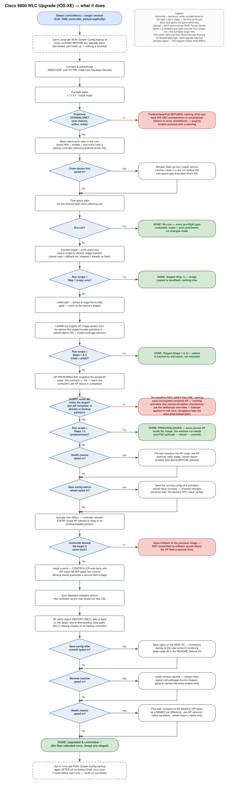

# What the 9800 upgrade does (overview)

A plain, high-level summary of the **Cisco 9800 WLC Upgrade (IOS-XE)** job —
the sibling of the switch job, sharing its engine and most of its spine. What
this diagram adds over [the switch overview](overview-flow.md) is the
wireless-specific machinery: the **positively-standalone topology gate**, the
**blast-radius echo**, the device-**learned** AP image version, the
**AP predownload phase** with its per-AP completion gate and its own
zero-impact stop, and the **report-only AP rejoin** after the reload.

## How to read it

- Same visual language as the switch overview: **diamonds** = decisions,
  **white rounded boxes to the right** = opt-in side-steps that rejoin the
  spine, **dashed** = once-per-run (the Golden Config bracket), **green** =
  a successful end state (one per Run scope), **red** = this controller
  stops here.
- Two of the three red boxes are the wireless job's signature refusals,
  and both stop **before anything reloads**: a topology reading that is
  not **positively standalone** (silence is never standalone; HA SSO
  orchestration is unvalidated), and the predownload **deadline declaring
  failure with every incomplete AP named** — the deadline never expires
  into success, and the named-exception checkboxes are the only overrides
  (*Proceed despite incomplete APs* applies to Full runs). The third red
  box — boot failure after activation, auto-rollback — is shared with the
  switch job.
- **AP rejoin never gates the commit** (drawn after it, report-only):
  refusing to commit on an AP shortfall would let the rollback timer revert
  the controller and force every already-swapped AP to downgrade again — a
  guaranteed second fleet-wide outage traded for a partial one.
- The `Steps 1-3 (predownload)` green stop is the point of the job: the
  fleet holds the image, nothing has reloaded, and the maintenance-window
  run needs only activate → reload → commit.

## Editing the diagram

Both files are generated from one node model in
[`../scripts/gen_9800_overview.py`](../scripts/gen_9800_overview.py) — edit
the model and run `python scripts/gen_9800_overview.py` to regenerate
[`9800-overview-flow.drawio`](9800-overview-flow.drawio) (editable) and the
SVG together. The diagram mirrors
`jobs/c9800_upgrade.py`'s `_upgrade_controller()` at overview altitude — if
the gate order or an abort-vs-warn decision changes in the code, update the
model in the same change.
