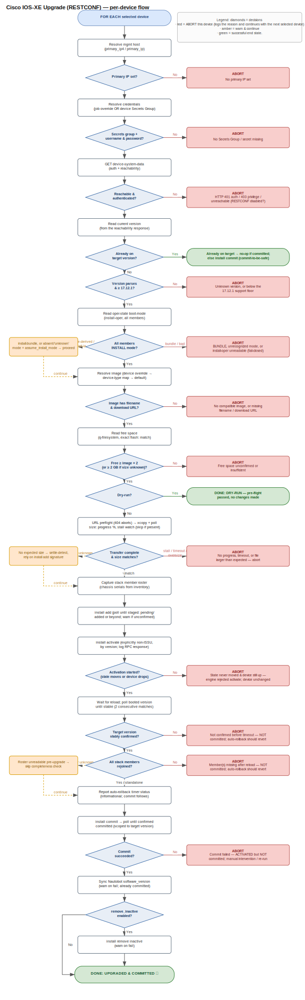

# Upgrade process flow

The per-device control flow of the **Cisco IOS-XE Upgrade (RESTCONF)** job
(`jobs/iosxe_upgrade.py`, `IOSXEUpgrade._upgrade_device`). The job runs this flow
independently for each selected device; an **ABORT** logs the reason and fails
**that device only**, then the job continues with the next selected device.

## How to read it

- **Diamonds** are decision points; **white boxes** are actions.
- **Red “ABORT”** = the device fails this gate (logged) and the job moves on to
  the next device. **Amber** = a warning is logged but the flow continues.
  **Green** = a successful end state (already-on-target no-op, dry-run report, or
  a completed upgrade).
- The conservative design means almost every step is a PASS/FAIL gate, and the
  flow stops at the first failed gate. After `install activate`, a failure to
  return or boot the target version deliberately does **not** commit — the
  device's auto-rollback timer reverts it to the previous image.

## Editing the diagram

The editable source is **[`upgrade-flow.drawio`](upgrade-flow.drawio)** — open it
in [draw.io / diagrams.net](https://app.diagrams.net) (or the VS Code draw.io
extension). After editing, **export a new `upgrade-flow.svg`** (File → Export as →
SVG) so the embedded image above stays in sync.

> Both files are generated from one node/edge model in
> [`../scripts/gen_flow.py`](../scripts/gen_flow.py). Edit the model there and run
> `python scripts/gen_flow.py` to regenerate both — that keeps the `.drawio` and
> `.svg` from drifting. (Hand-editing the `.drawio` in draw.io and re-exporting
> the SVG also works.)

## Keeping it true to the code

This diagram is meant to match `_upgrade_device` exactly. If you change the gate
order, add/remove a gate, or change an abort-vs-warn decision in the code, update
the diagram in the same change.
